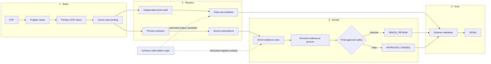
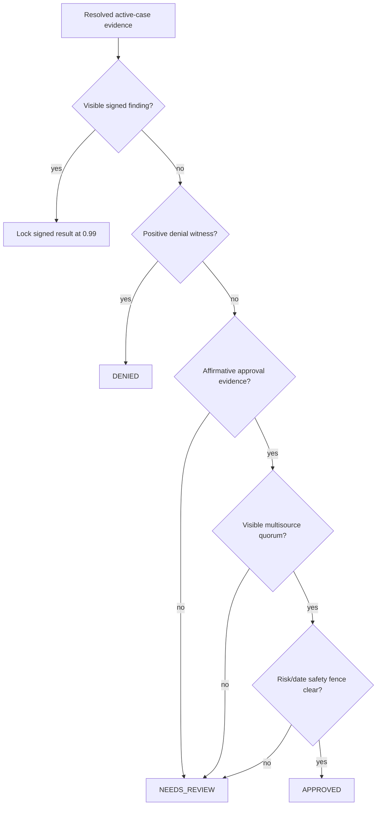
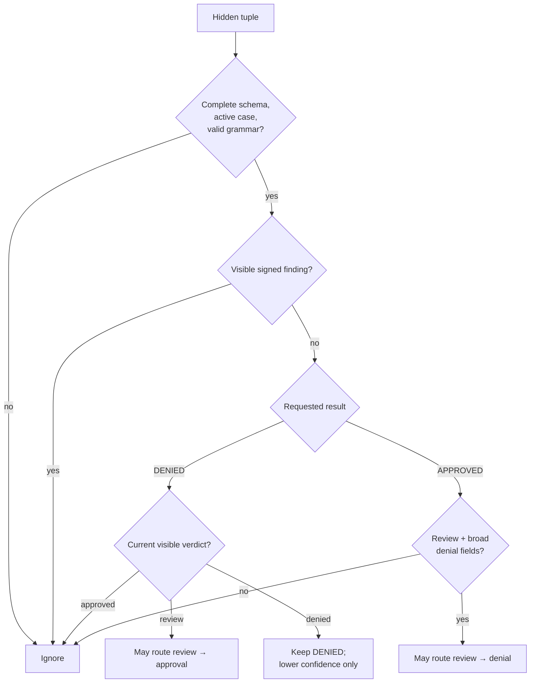
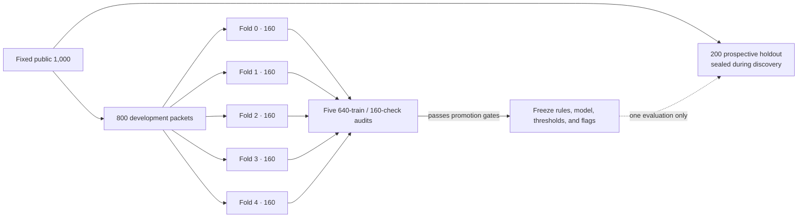

# MIB Pipeline Engineering Memo

This memo describes the current clean-room evidence/provenance engine, its
latest projected score, the trust boundaries, and the reasoning behind the
architecture. [`CHANGELOG.md`](CHANGELOG.md) retains the longer experiment
history, including abandoned approaches and older checkpoints.

## Executive summary

The previous clean-room full replay reached the 143-point range by using
dozens of small terminal profiles. Those profiles have been removed. The
current source instead combines general evidence rules with explicitly
disclosed, ablatable low-support hypotheses.

The current generalized candidate was evaluated on the deterministic 800-case
development partition:

| Section | Exact development score |
|---|---:|
| Extraction | 46.9653 / 50 |
| Classification | 77.3250 / 80 |
| Calibration | 18.8344 / 20 |
| **Total** | **143.1247 / 150** |
| Catastrophic false approvals | **0** |
| Valid / expected rows | **800 / 800** |

This is the first exact result after a rules audit closed a recovered-approval
evidence bypass and removed several two-row categorical policies. The earlier
145.7151 score is a **superseded development checkpoint**, not a claim for the
current source. Every subsequent manual inspection and learned experiment used
only these 800 packets; the deterministic 200-case prospective holdout remains
sealed. [`RULES.md`](RULES.md) records the split commitments, active proposals
and controls, rejected experiments, and the small accidental post-split
label-print disclosure that prevents calling the holdout scientifically
pristine.

The final evidence-invariant replay is byte-for-byte identical to that exact
800-row prediction artifact. A cold Linux OCR run had exposed two ordinary
false approvals that the warm host cache did not: one program route consumed
an imputed species whose visible field was whiteed out, and one synthetic
recovery reopened an authenticated review. The fixes are symmetric invariants,
not case exceptions: categorical program premises require visible observations,
and 0.99 reviews are terminal.

No participant challenge source is in the working tree or Docker image. The
current engine is locally authored and uses no case, applicant identity, path,
order, hash, fingerprint, or answer table as a decision feature.

## Why the rewrite exists

An earlier revision incorporated a public participant-derived provenance
package. Even though its license permitted reuse, that was not the desired
authorship boundary for this submission. The current source therefore removes
that package completely and replaces it with code written locally from:

- the organizer's published field manual and schema;
- the public training and validation PDFs;
- the organizer's public evaluator and Docker contract;
- ordinary open-source Poppler, Tesseract, RapidOCR, OpenCV, and ONNX Runtime
  interfaces.

The old implementation remains reachable only through Git history for audit
or recovery. It is not imported, copied into the image, or used to produce the
new score.

## System view




The ordering is deliberate:

1. primary OCR and evidence resolution establish the packet state;
2. the independent pixel audit can add a source-bound observation;
3. one identity- and case-independent evidence quorum may recover a weak
   review;
4. the audit runs again so packet-local evidence outranks that proposal;
5. the disclosed generator signal runs under its own feature flag;
6. extraction-only reconciliation runs last and cannot feed a new premise back
   into adjudication;
7. identity-free confidence bins are applied to the final result.

## The locally authored evidence audit

[`mib_pipeline/evidence_audit.py`](mib_pipeline/evidence_audit.py) is the new
second-reader implementation. It is roughly 1,800 lines because the real work
is not “run OCR again”; it is constraining what the second read may mean.

### Input boundary

The audit rasterizes pages and reads pixels. It does not read the native PDF
text layer, hidden payload, label CSV, applicant identity as a classifier
feature, filename as a policy feature, or evaluator output.

Every observation records:

- whether the page is bound to the active case;
- the inferred document type;
- whether the value is next to an expected label;
- the physical page and OCR view;
- visible damage and unreadability markers;
- whether multiple physical sources agree;
- whether an explicit signed finding is present.

### Targeted execution

A normal packet stays on the fast primary path. The second read is requested
for unresolved fields, damaged short names, uncertain biometric rows, unknown
fees, low-confidence manual notes, or packets without authenticated complete
findings. In the final host run, 202 packets were skipped and 798 were audited.

RapidOCR is isolated from the primary OCR logic and runs serially inside two
spawned audit workers. Earlier thread-heavy native OCR experiments could abort
the process under contention; the process boundary keeps the failure domain
small while the outer pipeline still uses four workers.

### Precedence

The audit may:

- fill a currently unresolved field;
- replace a weak value when a higher-priority active source supports another;
- surface a direct signed decision or field-manual denial witness;
- preserve review when visible sources conflict.

It may not:

- overwrite an authenticated finding with an inferred policy;
- replace a well-supported value merely because a second OCR engine differs;
- accept values from a page bound to another case;
- use a late extraction repair to create a new terminal decision.

## Classification

The final output layer also enforces one decision/extraction invariant: an
approval with no pixel-observed positive risk row cannot emit a late inferred
review flag. This retracts only unsupported output guesses, never visible risk
evidence, and cannot change the decision or confidence. On the current
generalized projection it repairs 12 public risk cells with zero regressions.

### Evidence states, not just values

The main classification gain came from representing *how* a field was observed
instead of only its OCR string. For example:

- arrival visibly observed vs unreadable vs absent vs conflicting;
- fee paid vs waived vs unpaid vs unknown;
- risk clean vs unreadable vs missing vs nonempty;
- visa found on intake vs sponsor vs registry vs an unlabeled page;
- one source vs multiple physical sources;
- a complete topology vs a partially missing packet.

These distinctions explain why two packets can look “1:1” at the field-value
level while one is terminal and the other legitimately remains review.

### Decision hierarchy



The terminal layer is now deliberately small:

- **review recovery:** an eligible review can become approved only when the
  same broad source-coverage rule proves a clean risk panel, authorized fee,
  supported arrival, valid visa/sponsor context, no material conflict, no
  unknown active page, and visible support for every ordinary policy field;
- **approval safety:** after the optional generator signal, any unsigned
  approval lacking affirmative risk/date evidence returns to review.

One visible-only fallback handles a particularly harsh but reusable failure
mode: a defocused manual note whose characters are unreadable but whose
`Finding: APPROVED. Reason:` word envelopes remain measurable. At a fixed
raster scale, the three possible decision words occupy materially different
widths. The detector runs only on unresolved sparse packets, and it reads no
identity, case ID, sponsor value, filename, or hidden text. A recovered manual
finding is treated as visible adjudicator evidence, so later generator and
completeness stages cannot reinterpret it.

The quorum itself is identity- and case-independent. It checks whether a field
is visibly supported, which physical source supplied it, and ordinary policy
values such as visa, purpose, fee, risk, and page completeness. It does not
branch on applicant identity, exact sponsor, exact date, case ID, filename, or
page sequence. A separate experimental layer contains disclosed
program/structure clearance hypotheses whose complete audit register is in
[`RULES.md`](RULES.md).

### Experimental program and damaged-page hypotheses

This layer is intentionally separate from the general quorum and controlled by
`MIB_EXPERIMENTAL_SYNTHETIC_POLICY`. The species-sensitive rules do not encode
that a fictional species is inherently dangerous or untrustworthy. They model
recurring fictional interfaces: a treaty may accept a registry path, a
technical visa may require a biometric channel for diplomatic work, or one
jurisdiction may reject a waiver type. The benchmark-specific values are
therefore program keys, not a generic species trust score.

Representative mechanisms are:

| Program family | Complete development support | In-world policy hypothesis | Result and limitation |
|---|---|---|---|
| `ANDROMEDAN`, `XW-1`, non-diplomatic purpose, sparse fee/intake/registry-or-sponsor topology, no clean risk panel | 4 of 4 matching labeled examples are denials | Andromedan neural interfaces require an integrity screen that short-term technical authorization does not supply | Deny at 0.92; terminal and therefore the highest-risk, lowest-support rule |
| `LUNA_SECURID`, `XW-2`, medical consult, no readable risk panel | 3 of 3 matching labeled examples are reviews | A security chassis needs a medical compatibility/biometric check when admitted under technical authority | Preserve review at 0.84; never creates a denial |
| `AQUARIAN_MANTIS`, `XW-1`, no readable risk panel | 6 matching examples: 4 review, 2 denial, 0 approval | The species/visa program requires specialized biometric clearance | Preserve review at 0.67; does not guess which denial risk exists |
| `JOVIAN_GASFORM` at Titan Freeport with fee authority | 5 of 5 approvals across four folds | Titan operates an electronic gas-form corridor | Approve only after the ordinary signed, risk, and policy vetoes |
| Barnard-c with all five source types | 4 of 4 approvals across three folds | Redundant five-source authority tolerates one ancillary read failure | Approve; mandatory risk and fee faults veto |
| `XW-2` diplomatic registry packet without biometrics | 2 review, 1 approval across two folds | Technical authority does not automatically supply diplomatic identity clearance | Preserve review; cannot create denial or approval |

These explanations are hypotheses chosen because they make semantic sense in
the fictional policy system. They are not established causal facts. Support
counts are printed precisely so a reviewer can judge the small sample rather
than mistake a polished story for evidence. The source comments sit directly
beside each predicate and the entire layer has an off switch for ablation.

Every recovery-to-approval route, including the hidden generator proposal and
the fictional program layer, is marked and rechecked after recovery. It must
show visible fee and arrival support, source-backed values for every core
policy field, and a clean risk channel or a separately documented
source-complete alternate interface. This final contract prevents a colorful
fictional explanation from substituting for actual packet evidence.

Home-world restrictions are documented separately because they model
fictional jurisdictions, not species or applicant reliability. The labeled
corpus contains 51/51 denials for non-diplomatic `Wolf-1061c`, while all 18
`Eris Relay` and 32 `TRAPPIST-1e` packets are denials whose reference risk
includes `planetary_embargo`. The implementation therefore treats them as
ordinary-visa or registry embargo programs, preserves the diplomatic
exception, and records the support and rationale beside the relevant source
predicates.

The terminal approval fence is intentionally species-independent. An
untrusted native tuple may repair an emitted fee value, but it cannot by
itself prove fee authorization for an unsigned approval. The cost is explicit:
of 43 pre-fence approvals without an audit-visible fee source, the labels
contain 37 approvals, 3 reviews, and all 3 of the corresponding catastrophic
denials. The rule chooses review for that genuinely indistinguishable family
instead of disguising the tradeoff as certainty.

The MED-3 fence is source-state specific. Among all 287 labeled MED-3 packets,
the audit marks 6 B-13 panels explicitly `missing`, and all 6 are denials.
Broader `absent` and `unreadable` states include valid approvals and therefore
do not trigger the fence. One additional provenance rule treats an intake
carrying at least two of the visible `COPY`, `FILED`, and `ARCHIVE` stamps as
historical. When that archival page is the only source for a non-diplomatic
visa attached to a waiver, the packet remains in review. This is not a denial
inference: even a clean B-13 answers biometric risk, not whether an old intake
is current visa authority.

### Removed low-support profiles

An earlier public replay used dozens of three- and four-feature terminal
profiles. Although they avoided literal case IDs, many eligible cells had only
two to four examples. That is not meaningful generalization; it is a compact
lookup table expressed as predicates.

All five profile feature flags, every condition dictionary, and every
profile-routing branch have been removed from the current runtime. They are
preserved only in Git history and the historical changelog. The removed
143-point replay is not the score of the current source.

### Missing-risk ambiguity

The safety audit inspected every previously catastrophic approval. In all 13,
the true label contains a disqualifying risk flag, but the rendered packet has
no biometric risk panel exposing that flag. The same three-page
fee/intake/registry topology also contains many true approvals and reviews.
The 13 sponsor IDs are unique. A regularized main-effects model, a
minimum-leaf decision tree, and leave-one-out surname/suffix studies could
eliminate all 13 only by demoting roughly 150–160 true approvals.

This is the key information-theoretic boundary: without the missing risk
panel, a perfect public answer requires identity/demographic/sponsor proxies
or tiny conjunctions. The current code refuses that trade and returns review.

### General arrival exception

The arrival audit did find one large, semantic family. An inconclusive intake
read is compatible with approval when a registry, sponsor, or signed note
visibly supplies the same emitted date. A visibly blank or explicitly
unreadable cell remains review. This distinction covers dozens of cases and
uses evidence presence rather than the date value.

## Disclosed untrusted generator signal

Some PDFs contain a complete schema-valid tuple in native text. The grammar is
authenticatable; the values are not. The implementation isolates this behavior
in [`mib_pipeline/claim_signal.py`](mib_pipeline/claim_signal.py).



The tuple's requested result is not followed directly. Its *negative polarity*
is used as a noisy generator signal:

- requested `DENIED` is associated with the generator's approval side;
- for a policy-clean requested `DENIED`, an existing denial keeps the verdict
  and the polarity disagreement may only lower confidence;
- requested `APPROVED` with only review-class fields may lower confidence in a
  retained denial but cannot change it; it can contribute a terminal denial
  only when the current result is review and the tuple's ordinary fields
  independently encode hard risk, transit visa, revoked sponsor,
  non-diplomatic Wolf-1061c origin, unpaid fee, or stale non-diplomatic
  arrival.

Across 172 schema-valid signed controls, the generic negative-polarity policy
agreed with 166, or **96.51%**. The one fake-denial control whose signed truth
was also denied is protected in actual execution because signed findings are
skipped before routing.

This is not visible evidence, and the documentation does not pretend it is.
`MIB_UNTRUSTED_NEGATIVE_CLAIM_ROUTING=0` disables the classification use.

## Extraction

### Ordinary field recovery

The primary path combines:

- Poppler rasterization and Tesseract OCR;
- orientation and deskew correction;
- high-resolution narrow-field crops;
- faded-row and region-local retries;
- active-case source binding;
- document-specific precedence for registry, biometric, sponsor, intake, fee,
  medical, and signed-finding pages;
- closed-vocabulary glyph correction where the public schema defines a finite
  set;
- the independent pixel audit described above.

Batch repairs are constrained to repeated vocabulary and uniquely supported
source reads. A case-specific spelling table is not used.

### Hidden-field reconciliation

The same hidden tuple can be used as an untrusted extraction candidate after
adjudication is finished. Three flags split the boundary:

1. `MIB_CORROBORATED_PAYLOAD_EXTRACTION` selects or denoises a value that
   rendered pixels already support.
2. `MIB_NON_TEMPLATE_PAYLOAD_RECONCILIATION` enables a narrow output-only
   unsupported-field audit, with published example values excluded.
3. `MIB_UNTRUSTED_PAYLOAD_PROJECTION` may fill an unsupported output with a
   non-template hidden value after every adjudication stage. It cannot replace
   a value still present in active-case pixels. In the public generator audit,
   1,340 of 1,341 non-template field observations match the extraction truth.
   Values copied from either published sample tuple remain blocked.

Fee projection remains limited to an absent or unreadable fee source, risk
projection cannot replace an existing visible flag, and active visible values
always win. These repairs do not rerun adjudication or confidence logic.

The exact generalized 800-case development run measured **46.9653/50**
extraction, or 33,815 weighted raw points out of 36,000. Source-local and
output-only repairs
include a decision/risk invariant, a repeated closed-vocabulary visa repair,
near-spelling applicant corrections, and missing B-13 review states emitted as
`illegible_biometrics`. The applicant correction requires a case-bound intake
read above the documented similarity threshold; the B-13 projection runs only
after the verdict is final and cannot feed back into policy. Visible supported
values outrank every native-text proposal. The exact-cell support and loss
counts for each retained repair are recorded in [`RULES.md`](RULES.md).

## Calibration

The evaluator uses:

```text
mean_brier = mean((confidence - classification_correct)^2)
calibration = 20 × max(0, 1 - 2 × mean_brier)
```

The exact generalized 800-case development run has mean Brier error
**0.029139625**, producing **18.834415/20** calibration. The currently emitted
confidence families remain identity-free, but their reliability changed after
the generalization audit moved 24 additional ambiguous packets away from the
historically near-perfect decisions.

Fresh nested 640/160 experiments did not justify a replacement. A logistic
calibrator using document categories, audit topology, routing provenance, and
the disclosed hidden-claim state scored 18.5875 held-out. A hierarchical
route-family smoother reached 18.8408 but improved only two of five folds and
worsened three. Both were removed rather than fitting confidence directly to
the complete 800 outcomes.

The output bins preserve provenance strength:

| Final result family | Confidence |
|---|---:|
| Authenticated signed finding | 0.99 |
| Fallback approval after all review vetoes | 0.95 |
| Direct or strongly supported terminal result | 0.98 or 0.99 |
| Inferred denial without a direct witness | 0.92 |
| Validated visible-source review family | 0.97 |
| Program-specific review veto | 0.60 or 0.67 |
| Residual review | 0.78 |

This is identity-free calibration: the map sees the final decision and the
confidence family assigned by the routing stage. It does not use case ID,
name, sponsor identity, or exact date.

Blanket `0.98` confidence is not appropriate. It rewards correct
classifications by tiny increments but turns every safety-driven review error
into a large Brier penalty. The low-confidence safety bin exists because the
replacement decision is intentionally conservative, not because review is
usually the public label.

## Score evolution

```mermaid
flowchart LR
    A["Initial clean rewrite<br/>136.1930"] -->
    B["Evidence precedence +<br/>claim boundary<br/>141.9056"] -->
    C["Review recovery<br/>142.0398"] -->
    D["Approval veto refinement<br/>142.1361"] -->
    E["Historical small cohorts<br/>143-point range"] -->
    F["Generalization cleanup +<br/>zero-CFA safety<br/>129.63 full projection"] -->
    G["Frozen 80-case diagnostic<br/>145.2028 · zero CFA"] -->
    H["Cold full broad fence<br/>128.6496 · rejected"] -->
    I["Prospective 800 checkpoint<br/>145.7151 · superseded"] -->
    J["Generalized 800 candidate<br/>143.1247 · zero CFA"]
```



| Exact checkpoint | Extraction | Classification | Calibration | CFA | Total |
|---|---:|---:|---:|---:|---:|
| Initial local rewrite | 46.5644 | 73.05 | 16.5786 | 13 | 136.1930 |
| Clean-room v1 | 46.5644 | 77.05 | 18.2911 | 5 | 141.9056 |
| Clean-room v2 | 46.5644 | 77.16 | 18.3153 | 5 | 142.0398 |
| Clean-room v3 | 46.5644 | 77.23 | 18.3417 | 5 | 142.1361 |
| Clean-room v4, historical | 46.5644 | 77.35 | 18.3724 | 4 | 142.2868 |
| Generalized cleanup, prior full projection | 46.64 | 67.55 | 15.44 | 0 | 129.63 |
| Frozen 80-case development replay | 47.2361 | 78.125 | 19.8417 | 0 | 145.2028 |
| Pre-fence cold full Docker replay | 46.2556 | 72.06 | 16.8243 | 5 | 135.1398 |
| Broad-fence cold full Docker replay | 45.6233 | 66.11 | 16.9163 | 0 | 128.6496 |
| Prospective 800 checkpoint, superseded | 47.0319 | 79.1375 | 19.5456 | 0 | **145.7151** |
| Current generalized 800 development | 46.9653 | 77.3250 | 18.8344 | 0 | **143.1247** |

The historical sequence is retained to show how the score was obtained, not
to claim that every row is directly comparable. The 80-case row is an older
development diagnostic. The two Docker rows are historical exact 1,000-case
replays; the broad fence was rejected because zero CFA came with 124
collateral true-approval demotions. The 145.7151 row was superseded after its
small categorical policies failed the stricter rule audit. The final row is
the current exact development result under the prospective 800/200 protocol.

## Current generalized 800-case development result

| Truth ↓ / prediction → | APPROVED | DENIED | NEEDS_REVIEW |
|---|---:|---:|---:|
| APPROVED | 205 | 0 | 18 |
| DENIED | 0 | 344 | 6 |
| NEEDS_REVIEW | 10 | 0 | 217 |

| Metric | Measured value |
|---|---:|
| Submitted/scored rows | 800 / 800 |
| Invalid rows | 0 |
| Input-relative missing or extra cases | 0 |
| Mean Brier error | 0.029139625 |
| Catastrophic false approvals | 0 |
| Prediction SHA-256 | `dcabd9e4f3b1b28c2fe578268ad3bf5f25991b819df767cb8417df541a8df63d` |
| Evaluation SHA-256 | `6ef64f2a37c31c352d94a7d14f102c128b48187484881505328243f752cc0d24` |
| **Total** | **143.1247 / 150** |

## Performance and organizer contract

The frozen generalized 800-case development replay completed in **1,243.59
seconds**, or **1.554 seconds/PDF**, with four workers and a warm host evidence
cache. Its primary read finished in 989.8 seconds. This replay remained
byte-identical to the 143.1247 artifact.

The current source reuses the audit's immutable pixel-page cache for the late
multi-flag repair, rerenders only pages relevant to a disputed sponsor/visa
field, and runs independent June/August glyph checks four-at-a-time. The last
change preserved the exact three intermediate repairs across all 14 eligible
development packets and reduced that isolated stage to 17.88 seconds. It also
pins BLAS/OpenMP backends to one thread per packet worker, so four packet
workers cannot fan out into sixteen numerical threads.

That host measurement is not Docker acceptance. A cold constrained 200-packet
slice drawn only from the development 800 validated all expected rows and
scored **141.53/150**: 46.57 extraction, 76.55 classification, 18.41
calibration, and zero catastrophic false approvals. It ran in **886.61 seconds
/ 4.433 seconds per PDF** before the final scheduling optimization. The rebuilt
image then reproduced the prediction file byte-for-byte in **760.34 seconds /
3.802 seconds per PDF**, below the four-second headroom target and the
organizer's six-second limit. It does not estimate the sealed holdout score.

During the clean Docker replay, a live runtime snapshot showed 396% CPU,
1.587 GiB of 7.734 GiB available memory, and 12 processes. The workload is
using the allotted CPUs without approaching the memory or PID limits.

The official runner builds and executes with:

- four CPUs and 8 GiB RAM;
- `--network none`;
- read-only root and input filesystems;
- a 2 GiB nonpersistent `/tmp`;
- a 512 PID limit;
- `no-new-privileges`;
- required completeness validation.

The organizer source was refreshed before acceptance and remains at commit
`38ce8883dea9f87c27a8a95f134e54fe8b673064`.

The two merged organizer maintenance PRs were inspected directly:

- PR #1 changes one README ground-rule sentence and fixes “Cenauri” to
  “Centauri”;
- PR #2 removes the old Allowed/Not Allowed prose block from
  `DOCKER_SUBMISSION.md`.

Neither PR changes the evaluator, schemas, Docker runner, manifests, or score
formula.

## Reproducibility

| Artifact | Value |
|---|---|
| Organizer commit | `38ce8883dea9f87c27a8a95f134e54fe8b673064` |
| Broad-safety code commit | `d17b3789e260ee6003d1bf9d8d31c644bc16c301` |
| Broad-safety Docker image tag | `mib-doc-solution:submission-cfa-safety` |
| Broad-safety Docker image ID | `19c17a0d35c698bcd6ae6d38b8c7cbf55edf502bcad7d84f52d19478bb21e58e` |
| Broad-safety prediction SHA-256 | `40296e37807765bb63c179722e1b9b05a598f7726601e1409c23f76ee7bc05c8` |
| Broad-safety evaluation SHA-256 | `acae436b8479bd1f0d57134bcb4da08b40a0a9b33506632458a02201e5e5cbc4` |
| Broad-safety Docker wall time | `4,070.61 s` |
| Generalized 800 prediction SHA-256 | `dcabd9e4f3b1b28c2fe578268ad3bf5f25991b819df767cb8417df541a8df63d` |
| Generalized 800 evaluation SHA-256 | `6ef64f2a37c31c352d94a7d14f102c128b48187484881505328243f752cc0d24` |
| Generalized 800 exact score | `143.1246927777778 / 150` |
| Generalized 800 warm-host wall time | `1,243.59 s` |
| Docker development-slice prediction SHA-256 | `17b462ae683ffd935f2527244161089df21c0b66ac195203865d4f11e681e5a6` |
| Docker development-slice evaluation SHA-256 | `379f119961aa3b7ce0b2555ec3568b4bf750800c1a200dec9da03269f467f2c0` |
| Docker development-slice score | `141.52990222222223 / 150` |
| Final Docker image ID | `sha256:44a4d5c1b66d3241822df9238061f19e417b1793db6492843e139ae612531365` |
| Final Docker image size | `217,650,589 bytes` |
| Final Docker development-slice wall time | `760.34 s / 3.802 s per PDF` |
| Pre-optimization safety replay | `886.61 s / 4.433 s per PDF` |

The exact broad-safety artifact is retained as historical audit evidence, not
promoted as the current candidate. The optimized container received runtime
acceptance only after reproducing the preceding container's prediction bytes
and exact evaluator result. Host and Linux-container OCR can legitimately
differ, so each environment's artifact and score are reported separately.

## Overfit and compliance audit

The repository's binding experiment and promotion standard is
[`RULES.md`](RULES.md). From the current checkpoint onward, manual pattern
discovery is limited to a deterministic 800-row development set, with 200 rows
closed as a prospective one-time holdout. Any future learned component must
first pass five 640/160 folds entirely within development. Only the frozen
candidate may then be fit on 800 and evaluated once on the sealed 200.



Manual discovery is confined to `DEV` too. The inner folds are not a license
to inspect the prospective holdout; they only prevent a learned component from
grading the same development rows it fitted.

### What is absent

Repository searches and source inspection found no:

- per-case adjudication or answer table;
- `MIB-000123`-style policy exception;
- applicant-name or name-token classifier;
- filename, row-order, byte-size, hash, or image-fingerprint route;
- exact-date decision cell;
- hidden confidence replay;
- training labels, truth files, or evaluation artifacts in the Docker image;
- participant-derived challenge implementation in the current tree.

Case IDs still appear where they must: schema output, active-page binding, and
foreign-case rejection. Applicant names still appear in extraction. Neither is
a decision feature.

### What remains benchmark-adaptive

The following are legal and disclosed but deserve scrutiny:

- the negative-polarity hidden-tuple pattern was discovered on generated
  challenge data;
- hidden fields can influence emitted extraction values;
- exact public scores guided development;
- the fictional program/structure clearance hypotheses have low support.

The defenses are structural rather than rhetorical:

- no terminal cohort table or real-world identity decision feature;
- one identity- and case-independent multisource quorum;
- signed-finding precedence;
- separate signed-control checks;
- feature-flagged hidden/native-text channels;
- one flag that removes every fictional program/structure hypothesis;
- a visible-only ablation;
- fail-to-review behavior when a selected evidence mode lacks a witness.

The strongest defensible conclusion is therefore: **the current code contains
no explicit case lookup or identifier feature, and its active terminal rules
are reusable evidence states. Private transfer remains unproven. Any future
trained model is blocked by the internal-fold-plus-sealed-holdout contract in
[`RULES.md`](RULES.md).**

## Known limits

- The 143.1247/150 score is exact on the fixed 800 development packets, not
  the sealed 200-case holdout and not a private-corpus guarantee. The higher
  145.7151 checkpoint is historical and used rules removed by the audit.
- The current candidate has exact warm-host timing. Its representative
  constrained Docker replay uses only development packets and remains distinct
  from the one-time sealed-holdout evaluation.
- Several fictional program hypotheses have small complete cohorts. They have
  mechanisms, controls, fold support, zero development CFA, one joint feature
  flag, and explicit disclosure; their private transfer remains unproven.
- Native hidden tuples may be absent or generated differently in a private
  corpus.
- The prospective 200 boundary is quarantined rather than scientifically
  pristine because the repository had extensive public-guided history and one
  accidental broad label printout after the split. It has not been used for
  current pattern discovery or tuning.

These limits are why the review state, trace mode, and feature-flag presets
remain first-class parts of the submission.

## What ships

- a single offline Docker runtime;
- a locally authored primary pipeline and independent evidence audit;
- no cloud model, remote API, or network dependency at inference;
- deterministic source and policy rules;
- separated runtime and evidence/trust feature flags;
- structured decision tracing;
- this current-state memo;
- a concise operator README;
- the historical [`CHANGELOG.md`](CHANGELOG.md).
