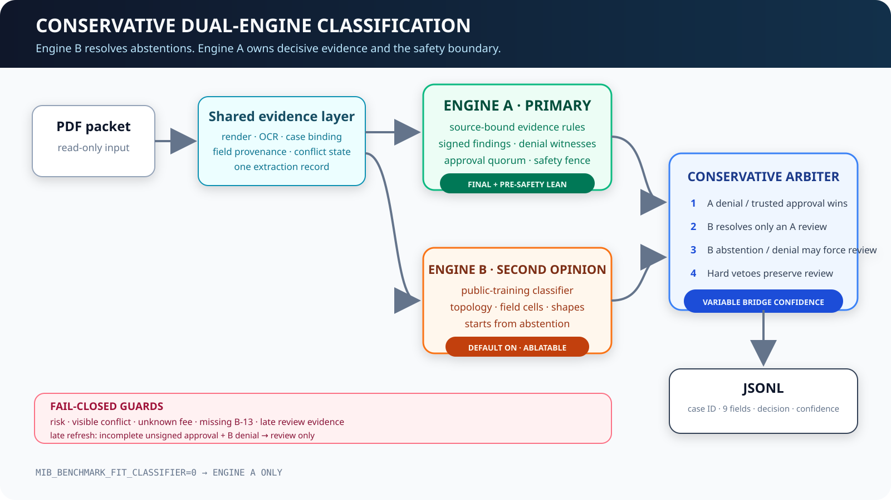
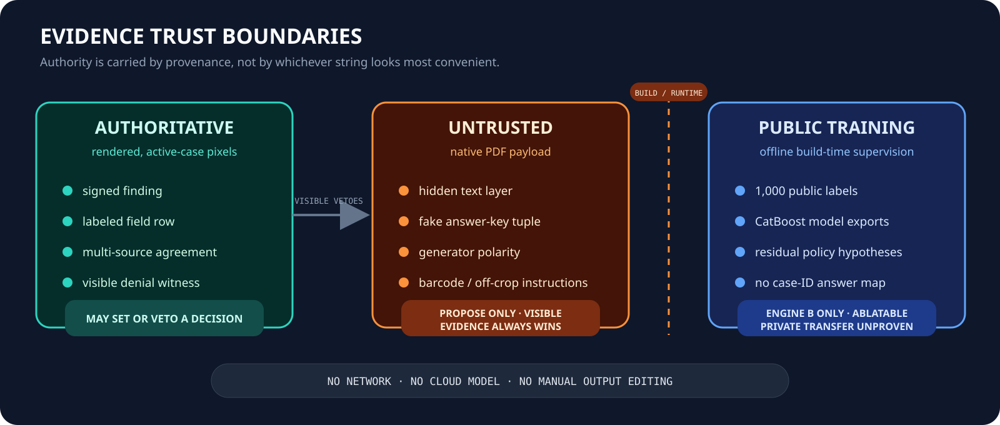

# MIB Doc Challenge — Technical Memo

**Submission:** midasavocado
**Solution:** <https://github.com/midasavocado/mib-doc-challenge-solution>

## Executive summary

This submission is an offline, CPU-only PDF evidence pipeline. It renders every
page, binds observations to the active case, reconciles fields by source
authority, and emits one schema-valid JSON object per packet. Classification is
fail-closed: a signed finding or positive denial witness can decide directly;
ordinary approval requires affirmative, source-bound support; unresolved
conflict remains `NEEDS_REVIEW`.

The release uses two classifiers. Engine A is the primary generalized evidence
engine: its policy core is pixel-visible, with separately flagged untrusted
channels disclosed below. Engine B is a separately feature-flagged model fit
to the 1,000 public training packets. Engine B is enabled by default, but the
arbiter is intentionally conservative: B may resolve an Engine-A review only
when it agrees with Engine A's independent pre-safety lean and no hard evidence
veto applies. Engine-A denials and authenticated approvals always win; an
unsigned Engine-A approval contradicted by an Engine-B denial falls back to
`NEEDS_REVIEW`, never to Engine B's denial.



## Pipeline

The primary pass rasterizes pages with Poppler and reads them with Tesseract.
Uncertain regions receive bounded rotation, deskew, faded-ink, and
high-resolution retries. A second locally authored evidence audit uses
RapidOCR on targeted pages. The two reads do not vote by string count. Each
candidate retains page type, active-case binding, label support, and source
provenance, so an intake row can outrank incidental policy prose and a foreign
case page cannot contaminate the active record.

Evidence is represented as state as well as value:

- observed, unreadable, absent, or contradictory;
- active-case versus foreign-case;
- labeled row versus incidental occurrence;
- one physical source versus multisource corroboration;
- signed finding, intake, biometric, sponsor, registry, fee, or unknown page.

This distinction explains much of the public corpus. Two packets can emit the
same apparent fields while having different adjudication support: one may have
a clean risk row and fee source, while the other has only inferred values or an
unreadable attachment.

After adjudication is frozen, extraction-only reconciliation may denoise
unresolved fields. Those late repairs cannot create a policy premise or change
the verdict.

## Classification

Engine A applies this precedence:

1. authenticated visible finding;
2. positive, active-case denial witness;
3. material conflict or explicit uncertainty fence;
4. affirmative multisource approval quorum;
5. `NEEDS_REVIEW`.

The final safety pass checks fee authority, arrival support, risk clearance,
MED-3 biometric requirements, unknown pages, and program-authority conflicts.
Signed findings remain highest authority. False approval prevention is
structural: a public-fit model cannot override an Engine-A denial, and every
bridged approval is still subject to the common hard vetoes.

Engine B is not presented as a generalization result. It uses public-label
correlations including document topology, low-cardinality field cells, name
shape, sponsor-number shape, and two locally trained CatBoost model exports.
It contains no case-ID answer map, filename lookup, validation predictions, or
manual row edits. At runtime it receives extracted fields, starts from
abstention, and produces an independent second opinion.

The arbiter accepts a bridge only when:

- Engine A's final result is `NEEDS_REVIEW`;
- Engine A had a decisive pre-safety lean;
- Engine B independently chooses the same direction;
- approval concerns only unsupported arrival or fee-source evidence;
- the record is otherwise complete, fee-authorized, risk-clean, and
  conflict-free; and
- no signed conflict, visible risk, medical-clearance failure, unknown fee, or
  authority mismatch is present.

Late pixel-visible review flags, blank active-case arrival cells, and
incomplete transit packets set a hard-review marker. That marker outranks an
older soft-gap state and cannot be bridged.

A bridged result receives confidence 0.90. A contradictory Engine-B denial may
veto an unsigned Engine-A approval only to `NEEDS_REVIEW`; it cannot override
an authenticated 0.99 Engine-A finding or create a denial. Otherwise the
Engine-A decision and confidence are preserved byte for byte. The whole branch
is removed with `MIB_BENCHMARK_FIT_CLASSIFIER=0`.

## Trust boundary and hidden text



The native PDF text layer is untrusted. It contains fake instructions and
answer-key-like tuples that may be useful as noisy OCR hypotheses but are not
document authority. The release has separately ablatable channels for
pixel-corroborated field denoising, final unresolved-field projection, and an
isolated negative-polarity generator signal. Visible supported values always
win; authenticated findings cannot be overwritten; field projection runs after
the decision boundary.

This is a disclosed benchmark tradeoff. Native text may change or disappear on
private packets, and private/admin labels may remove hidden-only fields from
the extraction denominator. The `visible_evidence_only` profile disables these
channels and Engine B together.

## Confidence

Confidence is assigned after the verdict is frozen. Engine A uses
provenance-strength bins followed by an identity-free monotone mapping selected
inside the development partition. It cannot use case ID, applicant name,
sponsor identity, exact date, or an output answer table. Engine B does not
replace this mapping globally: only an accepted bridge receives the explicit
0.90 tie-break confidence.

The evaluator's calibration term is Brier-based, so blanket 0.99 confidence is
unsafe even when it boosts a public replay. The conservative release therefore
removed the previous bridge behavior that set every combined-mode row to 0.99.

## Evaluation

The generalized work used a deterministic 800-case development partition and
an aggregate-only 200-case boundary. Manual inspection, model fitting, and rule
discovery were confined to the 800. The 200 exposed aggregate section scores
and catastrophic-false-approval count only; its PDFs, predictions, row errors,
traces, and confusion cells were not used for tuning.

| Candidate / boundary | Extraction | Classification | Calibration | Total | CFA |
|---|---:|---:|---:|---:|---:|
| Conservative default, public 1,000 candidate replay | 46.9478 | 73.4800 | 17.7769 | **138.2047** | 0 |
| Engine A development 800 | 46.9028 | 73.4500 | 17.8758 | **138.2286** | 0 |
| Aggregate-only 200 | 46.7389 | 71.5000 | 16.9360 | **135.1749** | 0 |
| Superseded aggressive bridge, public artifact replay | 46.6956 | 79.9400 | 19.9568 | **146.5924** | 0 |

The 146.5924 row is deliberately labeled historical. It applied an aggressive
B-resolves-any-review arbiter to a saved 1,000-row Engine-A artifact. It was not
a fresh run and it is not the current source's score. The conservative bridge
was adopted because Engine B's opaque validation behavior was materially lower
than its public fit; public leaderboard cosmetics are not evidence authority.

The exact constrained runner processed the public 1,000 in 3,546 seconds
(3.546 seconds/PDF total), with 1,000/1,000 valid rows. That run exposed two
catastrophic false approvals. One final repaired home-world value bypassed the
earlier embargo check; the other was an unsigned A approval contradicted by a B
denial. The release re-applies the existing embargo invariant after extraction
freeze and converts the latter disagreement only to review. Exact constrained
controls confirmed both transitions. Because those broad predicates affect
only two public output rows, the table reports their deterministic replay over
the full artifact rather than pretending a second full Docker run occurred.
The final image is 217,916,620 bytes (0.20 GiB). These are public runtime and
score checks, not validation/private-score evidence.

The frozen image subsequently completed the full 5,000-packet validation
directory under the same organizer controls. It emitted 5,000 unique,
schema-valid rows with zero missing or extra IDs. Container start to final
artifact emission took 17,682.5 seconds, or **3.5365 seconds/PDF total**. The
organizer validator passed against `data/validation_manifest.csv`; the
1,754,045-byte artifact SHA-256 is
`64c39e664ad3990f969ef18bb8fd3245d5238375c9098fce9ce30752ce703dc2`.
No private labels or validation score were available or inferred.

## Runtime and reproducibility

The Docker image accepts exactly:

```text
<input_pdf_dir> <output_predictions_path>
```

It runs without network access, API keys, cloud OCR, LLMs, VLMs, or external
services. Python wheels are pinned by version and SHA-256 in
`requirements.lock` and installed with `--require-hashes --no-deps`. Poppler
and Tesseract are installed at build time. BLAS/OpenMP thread counts are capped
so four packet workers do not oversubscribe the organizer's four CPUs.

The organizer source was fetched again on August 2. Its core remains commit
`38ce8883`; the rules, evaluator, schema, Docker runner, 6-second/PDF limit,
4-GiB image limit, and model-size limits are unchanged.

## Failure modes

- Engine B is deliberately public-fit and may not transfer to new layouts or
  distributions. The conservative arbiter reduces, but cannot prove away,
  that risk.
- Some Engine-A synthetic program hypotheses have small public cohorts.
  They are feature-flagged and paired with independent evidence vetoes.
- Hidden native values are noisy and may not exist on private data.
- Damaged biometrics and genuinely removed fields remain the largest honest
  extraction ceiling.
- Batch vocabulary repair is deterministic but can depend on the composition
  of the input directory.
- The aggregate-only 200 has been queried more than once and is not described
  as a pristine scientific holdout.

## Authorship and licensing

The active primary pipeline, evidence audit, terminal rules, bridge, and
documentation were written locally against the organizer's public field manual,
PDFs, schema, and evaluator. No participant PR or participant challenge
implementation is included in the current tree or Docker image. Engine B's
generated model heads come from this repository's own history and were trained
locally on public labels.

Open-source notices are retained under `third_party_licenses/`. That directory
covers CatBoost Apache-2.0, RapidOCR and PaddleOCR model provenance, plus the
licenses and notices shipped by the pinned runtime wheels.

## With another week

1. Replace Engine B's public-fit cells with nested cross-fit, source-only
   features and a second untouched private-style packet generator.
2. Train calibration jointly with the final classifier rather than calibrating
   a moving routing stack.
3. Add region-local biometric restoration that can prove legibility without
   expanding whole-page OCR cost.
4. Remove batch-dependent field imputation by learning a fixed vocabulary only
   from the declared public training partition.
5. Fuse the primary and audit schedulers around one shared raster while keeping
   the selective audit gate; auditing every packet is slower than the current
   201-packet skip.
