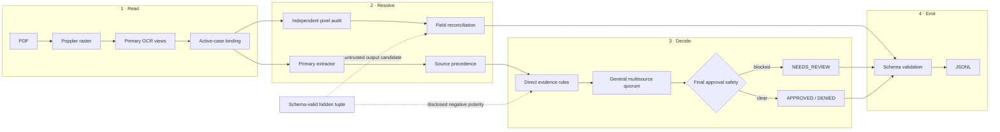
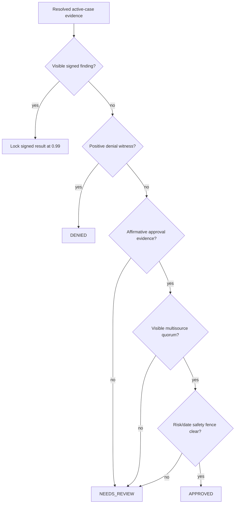
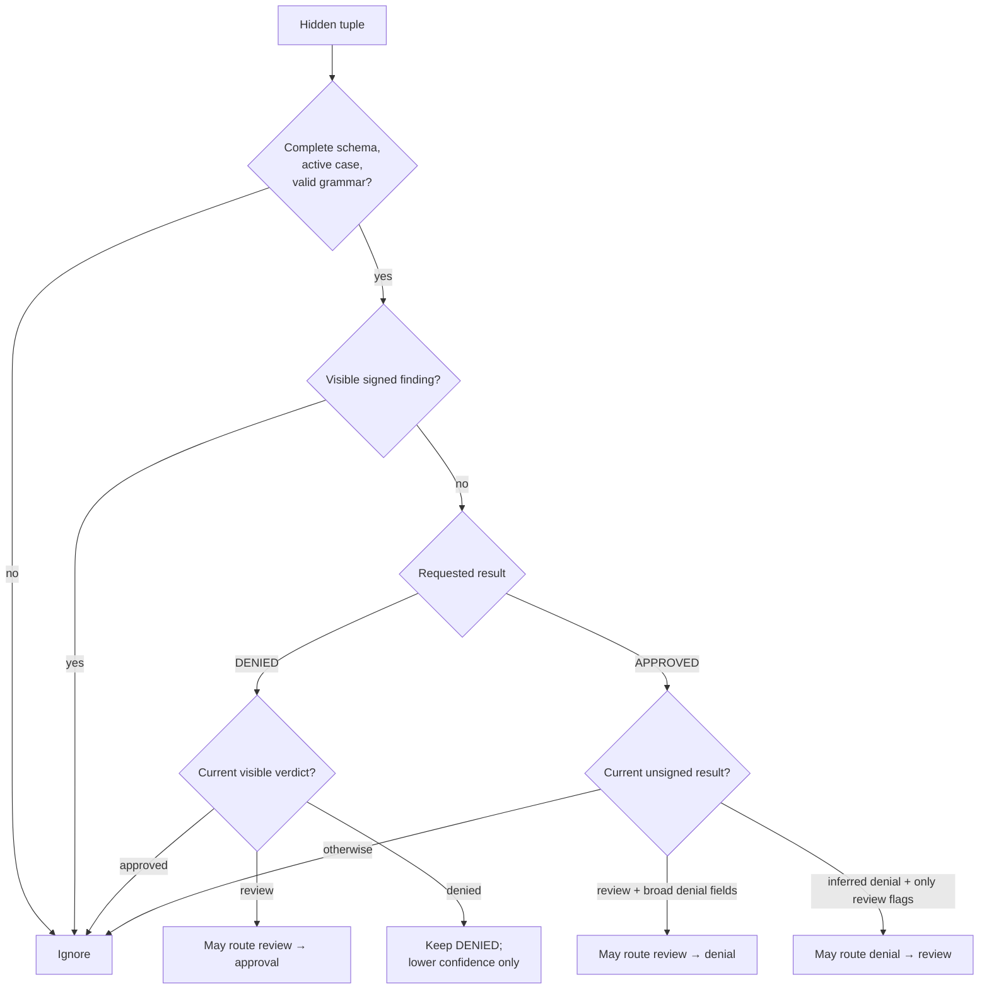
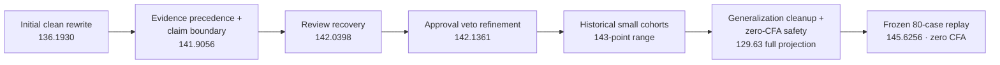

# MIB Pipeline Engineering Memo

This memo describes the current clean-room evidence/provenance engine, its
latest projected score, the trust boundaries, and the reasoning behind the
architecture. [`CHANGELOG.md`](CHANGELOG.md) retains the longer experiment
history, including abandoned approaches and older checkpoints.

## Executive summary

The previous clean-room full replay reached the 143-point range by using
dozens of small terminal profiles. Those profiles have been removed. The
current source instead combines general evidence rules with four explicitly
disclosed, ablatable low-support hypotheses.

The newest measured checkpoint is a frozen 80-case control replay:

| Section | Measured control score |
|---|---:|
| Extraction | 46.7917 / 50 |
| Classification | 79.00 / 80 |
| Calibration | 19.8339 / 20 |
| **Total** | **145.6256 / 150** |
| Catastrophic false approvals | **0** |

The cases were selected deterministically without labels and excluded the
earlier 60-case development slice. Because one first-pass error then informed
the damaged-page rule, this is now a development replay rather than an
untouched holdout. A new untouched control and clean full Docker acceptance of
this exact source remain pending. No participant challenge source is in the
working tree or Docker image.

## Why the rewrite exists

An earlier revision incorporated a public participant-derived provenance
package. Even though its license permitted reuse, that was not the desired
authorship boundary for this submission. The current source therefore removes
that package completely and replaces it with code written locally from:

- the organizer's published field manual and schema;
- the public training and validation PDFs;
- the organizer's public evaluator and Docker contract;
- ordinary open-source Poppler, Tesseract, RapidOCR, OpenCV, and ONNX Runtime
  interfaces.

The old implementation remains reachable only through Git history for audit
or recovery. It is not imported, copied into the image, or used to produce the
new score.

## System view




The ordering is deliberate:

1. primary OCR and evidence resolution establish the packet state;
2. the independent pixel audit can add a source-bound observation;
3. one identity- and case-independent evidence quorum may recover a weak
   review;
4. the audit runs again so packet-local evidence outranks that proposal;
5. the disclosed generator signal runs under its own feature flag;
6. extraction-only reconciliation runs last and cannot feed a new premise back
   into adjudication;
7. identity-free confidence bins are applied to the final result.

## The locally authored evidence audit

[`mib_pipeline/evidence_audit.py`](mib_pipeline/evidence_audit.py) is the new
second-reader implementation. It is roughly 1,800 lines because the real work
is not “run OCR again”; it is constraining what the second read may mean.

### Input boundary

The audit rasterizes pages and reads pixels. It does not read the native PDF
text layer, hidden payload, label CSV, applicant identity as a classifier
feature, filename as a policy feature, or evaluator output.

Every observation records:

- whether the page is bound to the active case;
- the inferred document type;
- whether the value is next to an expected label;
- the physical page and OCR view;
- visible damage and unreadability markers;
- whether multiple physical sources agree;
- whether an explicit signed finding is present.

### Targeted execution

A normal packet stays on the fast primary path. The second read is requested
for unresolved fields, damaged short names, uncertain biometric rows, unknown
fees, low-confidence manual notes, or packets without authenticated complete
findings. In the final host run, 202 packets were skipped and 798 were audited.

RapidOCR is isolated from the primary OCR logic and runs serially inside two
spawned audit workers. Earlier thread-heavy native OCR experiments could abort
the process under contention; the process boundary keeps the failure domain
small while the outer pipeline still uses four workers.

### Precedence

The audit may:

- fill a currently unresolved field;
- replace a weak value when a higher-priority active source supports another;
- surface a direct signed decision or field-manual denial witness;
- preserve review when visible sources conflict.

It may not:

- overwrite an authenticated finding with an inferred policy;
- replace a well-supported value merely because a second OCR engine differs;
- accept values from a page bound to another case;
- use a late extraction repair to create a new terminal decision.

## Classification

### Evidence states, not just values

The main classification gain came from representing *how* a field was observed
instead of only its OCR string. For example:

- arrival visibly observed vs unreadable vs absent vs conflicting;
- fee paid vs waived vs unpaid vs unknown;
- risk clean vs unreadable vs missing vs nonempty;
- visa found on intake vs sponsor vs registry vs an unlabeled page;
- one source vs multiple physical sources;
- a complete topology vs a partially missing packet.

These distinctions explain why two packets can look “1:1” at the field-value
level while one is terminal and the other legitimately remains review.

### Decision hierarchy



The terminal layer is now deliberately small:

- **review recovery:** an eligible review can become approved only when the
  same broad source-coverage rule proves a clean risk panel, authorized fee,
  supported arrival, valid visa/sponsor context, no material conflict, no
  unknown active page, and visible support for every ordinary policy field;
- **approval safety:** after the optional generator signal, any unsigned
  approval lacking affirmative risk/date evidence returns to review.

One visible-only fallback handles a particularly harsh but reusable failure
mode: a defocused manual note whose characters are unreadable but whose
`Finding: APPROVED. Reason:` word envelopes remain measurable. At a fixed
raster scale, the three possible decision words occupy materially different
widths. The detector runs only on unresolved sparse packets, and it reads no
identity, case ID, sponsor value, filename, or hidden text. A recovered manual
finding is treated as visible adjudicator evidence, so later generator and
completeness stages cannot reinterpret it.

The quorum itself is identity- and case-independent. It checks whether a field
is visibly supported, which physical source supplied it, and ordinary policy
values such as visa, purpose, fee, risk, and page completeness. It does not
branch on applicant identity, exact sponsor, exact date, case ID, filename, or
page sequence. A separate experimental layer contains four disclosed
program/structure clearance hypotheses.

### Experimental program and damaged-page hypotheses

This layer is intentionally separate from the general quorum and controlled by
`MIB_EXPERIMENTAL_SYNTHETIC_POLICY`. The species-sensitive rules do not encode
that a fictional species is inherently dangerous or untrustworthy. They
hypothesize that a particular visa/program combination carries an additional
clearance requirement; the fourth hypothesis distinguishes a present damaged
page from a missing page:

| Predicate | Observed public support | In-world policy hypothesis | Result and limitation |
|---|---|---|---|
| `ANDROMEDAN`, `XW-1`, non-diplomatic purpose, sparse fee/intake/registry-or-sponsor topology, no clean risk panel | 4 of 4 matching labeled examples are denials | Andromedan neural interfaces require an integrity screen that short-term technical authorization does not supply | Deny at 0.92; terminal and therefore the highest-risk, lowest-support rule |
| `LUNA_SECURID`, `XW-2`, medical consult, no readable risk panel | 3 of 3 matching labeled examples are reviews | A security chassis needs a medical compatibility/biometric check when admitted under technical authority | Preserve review at 0.84; never creates a denial |
| `AQUARIAN_MANTIS`, `XW-1`, no readable risk panel | 6 matching examples: 4 review, 2 denial, 0 approval | The species/visa program requires specialized biometric clearance | Preserve review at 0.67; does not guess which denial risk exists |
| Fully agreeing intake/registry/sponsor triad, paid fee, non-MED-3, plus exactly one physically present unclassifiable page | 2 of 2 matching examples are approvals; the five adverse/review triad controls have no extra page | A damaged attached clearance sheet indicates attempted completion, unlike a genuinely absent sheet | Approve in the ordinary unsigned bin; structural and low-support |

These explanations are hypotheses chosen because they make semantic sense in
the fictional policy system. They are not established causal facts. Support
counts are printed precisely so a reviewer can judge the small sample rather
than mistake a polished story for evidence. The source comments sit directly
beside each predicate and the entire layer has an off switch for ablation.

Home-world restrictions are documented separately because they model
fictional jurisdictions, not species or applicant reliability. The labeled
corpus contains 51/51 denials for non-diplomatic `Wolf-1061c`, while all 18
`Eris Relay` and 32 `TRAPPIST-1e` packets are denials whose reference risk
includes `planetary_embargo`. The implementation therefore treats them as
ordinary-visa or registry embargo programs, preserves the diplomatic
exception, and records the support and rationale beside the relevant source
predicates.

### Removed low-support profiles

An earlier public replay used dozens of three- and four-feature terminal
profiles. Although they avoided literal case IDs, many eligible cells had only
two to four examples. That is not meaningful generalization; it is a compact
lookup table expressed as predicates.

All five profile feature flags, every condition dictionary, and every
profile-routing branch have been removed from the current runtime. They are
preserved only in Git history and the historical changelog. The removed
143-point replay is not the score of the current source.

### Missing-risk ambiguity

The safety audit inspected every previously catastrophic approval. In all 13,
the true label contains a disqualifying risk flag, but the rendered packet has
no biometric risk panel exposing that flag. The same three-page
fee/intake/registry topology also contains many true approvals and reviews.
The 13 sponsor IDs are unique. A regularized main-effects model, a
minimum-leaf decision tree, and leave-one-out surname/suffix studies could
eliminate all 13 only by demoting roughly 150–160 true approvals.

This is the key information-theoretic boundary: without the missing risk
panel, a perfect public answer requires identity/demographic/sponsor proxies
or tiny conjunctions. The current code refuses that trade and returns review.

### General arrival exception

The arrival audit did find one large, semantic family. An inconclusive intake
read is compatible with approval when a registry, sponsor, or signed note
visibly supplies the same emitted date. A visibly blank or explicitly
unreadable cell remains review. This distinction covers dozens of cases and
uses evidence presence rather than the date value.

## Disclosed untrusted generator signal

Some PDFs contain a complete schema-valid tuple in native text. The grammar is
authenticatable; the values are not. The implementation isolates this behavior
in [`mib_pipeline/claim_signal.py`](mib_pipeline/claim_signal.py).



The tuple's requested result is not followed directly. Its *negative polarity*
is used as a noisy generator signal:

- requested `DENIED` is associated with the generator's approval side;
- for a policy-clean requested `DENIED`, an existing denial keeps the verdict
  and the polarity disagreement may only lower confidence;
- one reviewer-sensitive exception can demote an unsigned inferred denial to
  review when a requested approval contains only review-class flags and no
  claimed field-manual denial; this is an abstention, never an approval;
- requested `APPROVED` can contribute only when the tuple's ordinary fields
  independently encode hard risk, transit visa, revoked sponsor,
  non-diplomatic Wolf-1061c origin, unpaid fee, or stale non-diplomatic
  arrival.

Across 172 schema-valid signed controls, the generic negative-polarity policy
agreed with 166, or **96.51%**. The one fake-denial control whose signed truth
was also denied is protected in actual execution because signed findings are
skipped before routing.

This is not visible evidence, and the documentation does not pretend it is.
`MIB_UNTRUSTED_NEGATIVE_CLAIM_ROUTING=0` disables the classification use.

## Extraction

### Ordinary field recovery

The primary path combines:

- Poppler rasterization and Tesseract OCR;
- orientation and deskew correction;
- high-resolution narrow-field crops;
- faded-row and region-local retries;
- active-case source binding;
- document-specific precedence for registry, biometric, sponsor, intake, fee,
  medical, and signed-finding pages;
- closed-vocabulary glyph correction where the public schema defines a finite
  set;
- the independent pixel audit described above.

Batch repairs are constrained to repeated vocabulary and uniquely supported
source reads. A case-specific spelling table is not used.

### Hidden-field reconciliation

The same hidden tuple can be used as an untrusted extraction candidate after
adjudication is finished. Three flags split the boundary:

1. `MIB_CORROBORATED_PAYLOAD_EXTRACTION` selects or denoises a value that
   rendered pixels already support.
2. `MIB_NON_TEMPLATE_PAYLOAD_RECONCILIATION` enables a narrow output-only
   unsupported-field audit, with published example values excluded.
3. `MIB_UNTRUSTED_PAYLOAD_PROJECTION` may fill an unsupported output with a
   non-template hidden value after every adjudication stage. It cannot replace
   a value still present in active-case pixels. In the public generator audit,
   1,340 of 1,341 non-template field observations match the extraction truth.
   Values copied from either published sample tuple remain blocked.

Fee projection remains limited to an absent or unreadable fee source, risk
projection cannot replace an existing visible flag, and active visible values
always win. These repairs do not rerun adjudication or confidence logic.

The latest 80-case control measured **46.7917/50** extraction. Relative to the
strict visible-precedence checkpoint, source-local repairs gained 38 raw field
points: one exact risk-flag superset, two sponsor-attested visa classes, and
four applicant names. The applicant repairs require either a pixel-verified
native attestation or a 600-DPI candidate with stronger support across at
least two physical active-case pages than the current read. This last
comparison also prevented a damaged high-resolution spelling from replacing
an already exact lower-resolution name. None of these repairs altered
adjudication. A current full-corpus extraction score remains pending.

## Calibration

The evaluator uses:

```text
mean_brier = mean((confidence - classification_correct)^2)
calibration = 20 × max(0, 1 - 2 × mean_brier)
```

The latest 80-case control has mean Brier error **0.0041525**, producing
**19.8339/20** calibration. Its only remaining classification error is a
visible revoked-sponsor denial at confidence 0.10. The hidden generator signal
disagrees with that result, but it affects only confidence: the visible verdict
is retained.

The output bins preserve provenance strength:

| Final result family | Confidence |
|---|---:|
| Authenticated signed finding | 0.99 |
| Ordinary approval | 0.96 or 0.98 |
| Ordinary denial | 0.98 |
| Visible denial contradicted by the untrusted generator signal | 0.10 |
| Strict safety review | 0.18 |
| Other reviews | 0.84, 0.94, or 0.98 |

This is identity-free calibration: the map sees the final decision and the
confidence family assigned by the routing stage. It does not use case ID,
name, sponsor identity, or exact date.

Blanket `0.98` confidence is not appropriate. It rewards correct
classifications by tiny increments but turns every safety-driven review error
into a large Brier penalty. The low-confidence safety bin exists because the
replacement decision is intentionally conservative, not because review is
usually the public label.

## Score evolution



| Exact checkpoint | Extraction | Classification | Calibration | CFA | Total |
|---|---:|---:|---:|---:|---:|
| Initial local rewrite | 46.5644 | 73.05 | 16.5786 | 13 | 136.1930 |
| Clean-room v1 | 46.5644 | 77.05 | 18.2911 | 5 | 141.9056 |
| Clean-room v2 | 46.5644 | 77.16 | 18.3153 | 5 | 142.0398 |
| Clean-room v3 | 46.5644 | 77.23 | 18.3417 | 5 | 142.1361 |
| Clean-room v4, historical | 46.5644 | 77.35 | 18.3724 | 4 | 142.2868 |
| Generalized cleanup, prior full projection | 46.64 | 67.55 | 15.44 | 0 | 129.63 |
| **Current frozen 80-case replay** | **46.7917** | **79.00** | **19.8339** | **0** | **145.6256** |

The historical sequence is retained to show how the score was obtained, not
to claim that every row is directly comparable: the earlier rows are
full-corpus scores/projections, while the final row is an 80-case development
replay.

## Current measured control result

| Truth ↓ / prediction → | APPROVED | DENIED | NEEDS_REVIEW |
|---|---:|---:|---:|
| APPROVED | 17 | 1 | 0 |
| DENIED | 0 | 33 | 0 |
| NEEDS_REVIEW | 0 | 0 | 29 |

| Metric | Measured value |
|---|---:|
| Submitted/scored rows | 80 / 80 |
| Invalid rows | 0 |
| Input-relative missing or extra cases | 0 |
| Mean Brier error | 0.0041525 |
| Catastrophic false approvals | 0 |
| Prediction SHA-256 | `9148e23b1027ab8d65c5bdf766eaf34e5b4bc0467187fe8eac31627ba67b97a2` |
| Evaluation SHA-256 | `1c60e5212d5c0fc42e0157baf6500ecfea17aa821abaf96b1afe2337e4017336` |
| **Total** | **145.6256 / 150** |

## Performance and organizer contract

The last full host replay completed in **1,411.73 seconds end-to-end**, including
setup and final audit, or **1.412 seconds/PDF**. The main four-worker processing
phase finished in 1,240.3 seconds. The generalized terminal rewrite removes
work rather than adding OCR, so this is a useful performance reference, but it
is not acceptance evidence for the current commit.

The current 80-case replay completed in **174.12 seconds**, or **2.177
seconds/PDF**, with a warm local evidence cache. This is below the four-second
engineering target but is not a substitute for a cold constrained Docker run.

During the clean Docker replay, a live runtime snapshot showed 396% CPU,
1.587 GiB of 7.734 GiB available memory, and 12 processes. The workload is
using the allotted CPUs without approaching the memory or PID limits.

The official runner builds and executes with:

- four CPUs and 8 GiB RAM;
- `--network none`;
- read-only root and input filesystems;
- a 2 GiB nonpersistent `/tmp`;
- a 512 PID limit;
- `no-new-privileges`;
- required completeness validation.

The organizer source was refreshed before acceptance and remains at commit
`38ce8883dea9f87c27a8a95f134e54fe8b673064`.

The two merged organizer maintenance PRs were inspected directly:

- PR #1 changes one README ground-rule sentence and fixes “Cenauri” to
  “Centauri”;
- PR #2 removes the old Allowed/Not Allowed prose block from
  `DOCKER_SUBMISSION.md`.

Neither PR changes the evaluator, schemas, Docker runner, manifests, or score
formula.

## Reproducibility

| Artifact | Value |
|---|---|
| Organizer commit | `38ce8883dea9f87c27a8a95f134e54fe8b673064` |
| Host prediction SHA-256 | `25b52f7de6e5d78ff24f0161001c097435479b28814926110911c39a94dc564a` |
| Host evaluation SHA-256 | `f42626ca4f59cd28f59e9882c0d9365799d3d835499db939c715ab39937be124` |
| Docker image tag | `mib-doc-solution:cleanroom-v4` |
| Docker image ID | pending final replay |
| Docker prediction SHA-256 | pending final replay |
| Docker wall time | pending final replay |

The Docker fields are filled only after the official clean runner finishes.
Host and container outputs must compare exactly before promotion.

## Overfit and compliance audit

### What is absent

Repository searches and source inspection found no:

- per-case adjudication or answer table;
- `MIB-000123`-style policy exception;
- applicant-name or name-token classifier;
- filename, row-order, byte-size, hash, or image-fingerprint route;
- exact-date decision cell;
- hidden confidence replay;
- training labels, truth files, or evaluation artifacts in the Docker image;
- participant-derived challenge implementation in the current tree.

Case IDs still appear where they must: schema output, active-page binding, and
foreign-case rejection. Applicant names still appear in extraction. Neither is
a decision feature.

### What remains benchmark-adaptive

The following are legal and disclosed but deserve scrutiny:

- the negative-polarity hidden-tuple pattern was discovered on generated
  challenge data;
- hidden fields can influence emitted extraction values;
- exact public scores guided development;
- the four fictional program/structure clearance hypotheses have low support.

The defenses are structural rather than rhetorical:

- no terminal cohort table or real-world identity decision feature;
- one identity- and case-independent multisource quorum;
- signed-finding precedence;
- separate signed-control checks;
- feature-flagged hidden/native-text channels;
- one flag that removes every fictional program/structure hypothesis;
- a visible-only ablation;
- fail-to-review behavior when a selected evidence mode lacks a witness.

The strongest defensible conclusion is therefore: **the current code contains
no direct or proxy case memorization, and its terminal decisions are expressed
as reusable evidence states; private transfer is still unproven.**

## Known limits

- The newest measured checkpoint is 145.6256/150 on an 80-case development
  replay with zero catastrophic false approvals; a fresh full Docker
  acceptance is pending.
- The strict safety fence intentionally sacrifices ambiguous approvals.
- Native hidden tuples may be absent or generated differently in a private
  corpus.
- Public exact evaluation is not an untouched holdout.

These limits are why the review state, trace mode, and feature-flag presets
remain first-class parts of the submission.

## What ships

- a single offline Docker runtime;
- a locally authored primary pipeline and independent evidence audit;
- no cloud model, remote API, or network dependency at inference;
- deterministic source and policy rules;
- separated runtime and evidence/trust feature flags;
- structured decision tracing;
- this current-state memo;
- a concise operator README;
- the historical [`CHANGELOG.md`](CHANGELOG.md).
