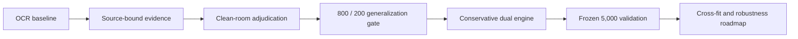

# MIB Document Challenge — Engineering Roadmap

**Submission:** midasavocado
**Purpose:** explain how the system evolved, what was rejected, where the
current candidate stands, and what should be built next. Runtime instructions
and the component reference live in [`README.md`](README.md); the full
experiment diary remains in [`CHANGELOG.md`](CHANGELOG.md).

## Starting point: extraction was not the whole problem

The first pipeline could read many fields, but classification stalled because
similar emitted rows did not necessarily have equal evidence. One packet might
show a clean B-13 panel and a visible fee receipt; another might emit the same
values after an OCR fallback or an unreadable page. Treating the final strings
as ground truth erased the difference between proof and a plausible guess.

The first major change was architectural: bind each observation to its active
case, page type, labeled row, and physical source. Narrow readers recovered
rotated fees, damaged findings, faded rows, and biometric slips. Late field
repairs moved behind a frozen decision boundary so extraction could improve
without silently creating policy authority.

## Clean-room rebuild: evidence before exceptions

An earlier participant-derived provenance package was removed completely. The
replacement evidence audit and terminal policy were written locally from the
organizer's PDFs, schema, field manual, and evaluator. The rewrite established
a stable precedence: authenticated finding, positive visible denial witness,
material conflict or uncertainty, affirmative multisource approval, then
`NEEDS_REVIEW`.

Packet layout, sponsor digits, name fragments, and generator-like hidden text
could separate public residuals, sometimes perfectly. They were not accepted
as general policy evidence. The primary engine was rebuilt around source
topology, visible program authority, and symmetric safety vetoes.

## Generalization gate: the score chase meets a wall

The public data was split deterministically into 800 development packets and a
200-packet aggregate-only validation boundary. Manual discovery and model
selection used the 800. The 200 returned only section scores, validity counts,
and catastrophic-false-approval count; its cases were not mined for repairs.

A full-fit forest looked excellent on its fitting rows, but five internal
640/160 audits produced only 72.20/80 classification and seven catastrophic
false approvals. It was deleted. Text, graph, neural, and residual-cell probes
were likewise rejected when they failed folds, used identity-like features, or
created approval without affirmative authority.

The promoted safety candidate added a broad rule requiring an unsigned
`MED-3` approval to carry affirmative clean B-13 evidence. On the development
800 it measured 138.2286/150 with zero CFA; the aggregate-only 200 measured
135.1749/150 with zero CFA. The score was lower than several public-fit
checkpoints, but it supplied the honest generalization anchor that later work
could not bypass.

## Dual-engine phase: use disagreement instead of hiding it

Engine A remains the generalized evidence adjudicator. Engine B is a disclosed
public-training second opinion reconstructed from this repository's own local
history. It uses two tabular heads plus public residual rules and is explicitly
not presented as private-transfer evidence.

The original aggressive bridge let B resolve every Engine-A review. A saved
public replay reached 146.5924/150 and zero public CFA, but that result was
measured on the same public distribution used to fit B. A later tie-breaker
required B to match A's pre-safety lean and proved too restrictive: B barely
changed the result.

The current candidate restores B as an abstention resolver without making it
the primary authority. An A denial or authenticated approval always wins. B
may resolve an A review, but approval is vetoed by positive risk, unknown fee,
explicitly missing medical clearance, incomplete recovered authority, visible
decision conflict, or late packet-local review evidence. In the safe reverse
direction, B abstention can demote an unsigned A approval to review only inside
repeated identity-free source-program families. Bridge confidence varies with
A's reliability, B's strength, the evidence gap, and their correlated inputs
instead of being fixed at 0.90.

## Decision ledger

| Milestone | Disposition | Reason |
|---|---|---|
| Source-bound evidence and selective high-resolution OCR | Kept | Improved recoverability while preserving page provenance |
| Participant-derived provenance package | Removed | Replaced with a local clean-room implementation |
| Full-fit forest and public-perfect residual phonebook | Rejected | Failed held folds or lacked a transferable mechanism |
| Generalized Engine A and MED-3 clean-B-13 requirement | Kept | Broad evidence rule with zero-CFA development and aggregate checks |
| Hidden/native text channels | Feature-flagged | Untrusted auxiliary hypotheses, never equivalent to visible authority |
| Engine B | Kept behind one flag | Useful benchmark-adaptive second opinion; transfer remains uncertain |
| Fixed bridge confidence of 0.90 | Removed in candidate | Discarded real variation in evidence and model agreement |

## Submission checkpoint

The frozen candidate completed an exact constrained public 1,000 run at
46.9478 extraction, 76.9800 classification, 18.3819 calibration, and
**142.3097 total**, with zero CFA. End-to-end runtime was 3,624.11 seconds
(3.62411 seconds/PDF). This is the current source's measured score, not an
artifact replay.

The same 217,919,202-byte ARM64 image then processed all 5,000 unlabeled
validation packets under the organizer's offline 4-vCPU/8-GiB contract. It
emitted 5,000 unique complete rows in 19,717.37 seconds (3.943474 seconds/PDF).
The organizer validator and an independent manifest/schema audit both passed.
Artifact SHA-256 is
`85ca045b1a5a652d6cc9d041966bee05cba17fc75675ef3be10ecccbb517b536`.

## Roadmap from here

1. **Replace public-fit B.** Train identity-free B heads inside nested 800-side
   folds using source state, evidence completeness, and document damage—not
   names, exact sponsor values, or residual lookup cells.
2. **Calibrate the final arbiter jointly.** Learn agreement, disagreement, and
   abstention reliability out of fold. Confidence should express correctness,
   not serve as a leaderboard knob.
3. **Share expensive vision work.** Fuse the primary and audit schedulers
   around one immutable raster cache, then add region-local biometric recovery
   without expanding whole-page OCR cost.
4. **Remove batch dependence.** Replace submission-wide name and year modes
   with a fixed development vocabulary so singleton and large-batch decisions
   remain identical.
5. **Build new controls.** Generate unseen damage/layout variants and require
   zero-CFA transfer before any broader approval authority is enabled.

The central lesson from the changelog is pleasantly unglamorous: the durable
gains came from better evidence boundaries, while the spectacular shortcuts
usually melted when shown a held fold. Future work should make the second
engine more independent—not merely more confident.

## Authorship and licensing

The active pipeline, evidence audit, terminal rules, bridge, and documentation
were authored locally. No participant PR or participant implementation is in
the runtime tree or image. Open-source runtime and model notices are preserved
under [`third_party_licenses/`](third_party_licenses/); the repository itself
is MIT licensed.
