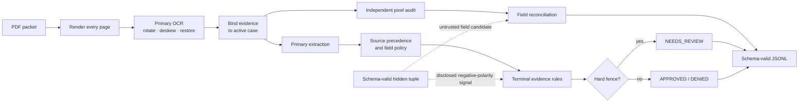
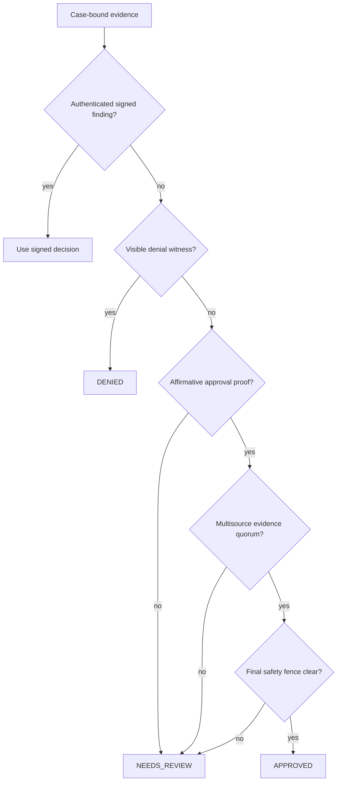
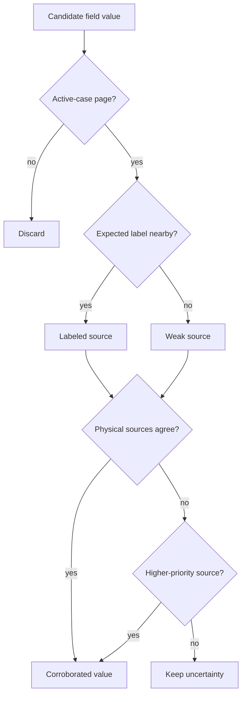

# MIB Document Intelligence Pipeline


An offline, CPU-only pipeline that converts damaged and contradictory MIB PDF
packets into one schema-valid JSONL record per case.

`4 CPU workers` · `No network at inference` · `Deterministic policy` ·
`Docker-ready` · `Feature-flagged evidence boundaries`

Development and promotion are governed by the stricter
[`RULES.md`](RULES.md) contract. New manual patterns use only a frozen 800-row
development set; learned components additionally require five internal
640/160 folds inside those 800 rows, followed by one frozen 800/200 audit.

## Current result status

The current generalized 800-case development candidate measured:

| Evaluator section | Exact development score |
|---|---:|
| Extraction | 46.9653 / 50 |
| Classification | 77.3250 / 80 |
| Calibration | 18.8344 / 20 |
| **Total** | **143.1247 / 150** |
| Catastrophic false approvals | **0** |
| Valid / expected rows | **800 / 800** |

This is the first exact run after a rules audit removed a recovered-approval
evidence bypass and several two-row program cells. The earlier 145.7151 result
is preserved as a superseded historical checkpoint, not presented as the
current score. The deterministic 200-case prospective holdout remains sealed.
Complete support, controls, rejected experiments, split commitments, and one
known boundary-contamination disclosure are in [`RULES.md`](RULES.md).

A second frozen-candidate replay after the Docker safety and scheduling work
was byte-for-byte identical to this 800-row artifact. The two Docker-specific
false approvals found on a 200-row development-only runtime slice were removed
with general evidence invariants: categorical program predicates must be
visible, and an authenticated 0.99 review cannot be reopened by a synthetic
program rule.

The decision layer uses visible/source-bound evidence rules plus explicitly
disclosed, jointly ablatable fictional-program hypotheses. It contains no
case-ID, filename, applicant-name, row-order, hash, image-fingerprint, or
answer-table adjudication feature. Low-support hypotheses remain disclosed as
transfer risks rather than being promoted into universal facts.

For historical context, a rejected broad safety fence scored 128.6496 on a
cold constrained 1,000-PDF Docker replay. It removed five catastrophic false
approvals but incorrectly demoted 124 true approvals, so that fence is not the
current policy. The historical result remains in [`CHANGELOG.md`](CHANGELOG.md)
instead of being presented as the current score.

## Architecture




The main extractor and the new pixel audit are deliberately independent. A
second read can fill an unresolved field or surface a direct policy witness,
but it cannot overwrite a supported value merely because another OCR model
disagrees.

After the verdict is final, one cross-field invariant removes an unsupported
late risk guess from an approval when the pixel audit observed no positive risk
row. An approved record cannot simultaneously claim an inferred review-only
risk. This extraction-only repair changes neither adjudication nor confidence.

| Component | Responsibility |
|---|---|
| [`mib_pipeline/pipeline.py`](mib_pipeline/pipeline.py) | Primary OCR, extraction, orchestration, serialization |
| [`mib_pipeline/evidence_audit.py`](mib_pipeline/evidence_audit.py) | Independent pixel read, provenance, precedence, reconciliation |
| [`mib_pipeline/terminal_approval.py`](mib_pipeline/terminal_approval.py) | General approval quorum and final safety fence |
| [`mib_pipeline/claim_signal.py`](mib_pipeline/claim_signal.py) | Isolated untrusted generator-polarity channel |
| [`mib_pipeline/feature_flags.py`](mib_pipeline/feature_flags.py) | Operational and evidence/trust controls |

## How decisions are made



The policy layer distinguishes absence, unreadability, and contradiction. An
inconclusive intake-date read can still be supported by the same visible date
on a registry, sponsor, or signed-note source. A visibly blank or explicitly
unreadable cell cannot. This rule covers dozens of packets and never reads an
identity or exact-date value as a class signal.

The terminal module contains general evidence quorums plus a disclosed
experimental fictional-program layer. Every unsigned recovery is passed
through the same final contract: visible fee support, visible arrival support,
source-backed core fields, and clean risk authority or a separately documented
source-complete alternate interface. Neither layer uses case IDs, applicant
names, sponsor fingerprints, exact dates, file hashes, row order, or a
public-label lookup table.

### Experimental program and damaged-page policies

The species-sensitive rules do **not** mean “this species is bad.” Each models
a possible program-specific clearance requirement suggested by the 800-case
development corpus. Support is small, so every rule is disclosed, commented
beside its predicate, and removable as one ablation with
`MIB_EXPERIMENTAL_SYNTHETIC_POLICY=0`.

| Scope | Observed labeled pattern | Plausible in-world policy hypothesis | Action |
|---|---|---|---|
| `ANDROMEDAN` + `XW-1`, non-diplomatic, sparse packet, no clean risk panel | 4/4 matching examples are denied | Short-term technical authority does not replace neural-integrity clearance for Andromedan interfaces | `DENIED` at 0.92 |
| `LUNA_SECURID` + `XW-2` + medical consult, no readable risk panel | 3/3 matching examples require review | Security chassis need a medical compatibility/biometric check under technical authority | Preserve `NEEDS_REVIEW` at 0.84 |
| `AQUARIAN_MANTIS` + `XW-1`, no readable risk panel | 4 reviews and 2 denials; no approvals | This species/visa program may require a specialized biometric clearance | Preserve `NEEDS_REVIEW` at 0.67 |
| Jovian gas form at Titan Freeport with fee authority | 5/5 approvals across four folds | Titan operates an electronic gas-form corridor | May propose approval, but the universal recovered-approval evidence contract still applies |
| Barnard-c with all five ordinary source types | 4/4 approvals across three folds | Redundant five-source authority can tolerate an ancillary damaged read | May propose approval; mandatory risk, fee, arrival, and core-field checks still veto |

The rationale is a testable fictional-world hypothesis, not proof of causation.
The Andromedan denial remains the riskiest small cohort. Program approval
predicates are proposals only; the final source-completeness fence is not
ablatable and runs after recovery.

Home-world checks are a separate fictional jurisdiction policy, not a species
or applicant trust score. All 51 labeled non-diplomatic `Wolf-1061c` packets
are denials; all 18 `Eris Relay` and 32 `TRAPPIST-1e` packets are denials whose
reference risk includes `planetary_embargo`. Accordingly, the code describes
these as ordinary-visa or registry embargo rules, keeps the diplomatic
exception explicit, and comments the support beside each predicate.

The final approval fence is broader and does not use species at all. A
schema-valid hidden/native candidate may repair an emitted fee value, but it
cannot by itself prove that an unsigned packet contains fee authorization.
This conservative rule is intentionally disclosed: among the 43 pre-fence
approvals without an audit-visible fee source, the labels contain 37
approvals, 3 reviews, and the 3 catastrophic denials. It eliminates that risk
at a real classification cost rather than pretending the ambiguity vanished.

The MED-3 rule is narrower. Across all 287 labeled MED-3 packets, the audit
finds 6 explicitly missing B-13 panels and all 6 are denials. Merely absent or
unreadable panels also contain approvals, so those broader states do not
trigger this fence. Finally, a visibly `COPY`/`FILED`/`ARCHIVE`-stamped intake
is treated as historical: if it is the only source for a non-diplomatic visa
attached to a waiver, the packet stays in review because a clean B-13
establishes biometric safety, not current visa authority. The stamps never
prove denial.

Separately, a visible-only fallback recognizes the printed word envelopes of
`Finding: APPROVED. Reason:` on severely defocused adjudicator notes. At the
fixed raster scale, `APPROVED` is materially wider than `DENIED` and narrower
than `NEEDS_REVIEW`. The fallback is restricted to unresolved sparse packets
and reads no identity, case ID, sponsor value, filename, or hidden text.

## Extraction and provenance

The ordinary extraction path:

1. rasterizes every page with Poppler;
2. performs the normal Tesseract read;
3. runs bounded rotation, deskew, faded-ink, high-resolution, or regional
   retries only when the packet needs them;
4. reads fixed-template word envelopes when a visible adjudicator finding is
   too defocused for character OCR;
5. attaches each value to its page type, label, active case, OCR view, and
   source priority;
6. invokes the locally authored RapidOCR pixel audit only for uncertain rows;
7. gives exact, active-case sponsor responsibility lines final precedence for
   the visa class they explicitly attest;
8. accepts a 600-DPI applicant read only when it has stronger support across
   at least two physical pages than the current spelling;
9. reconciles values without feeding output-only repairs back into policy.



### Disclosed hidden/native-text behavior

Some generated PDFs contain one complete schema-valid tuple in the native text
layer. It is untrusted and never treated as a signed finding or visible fact.
The default build nevertheless uses it in two explicitly feature-flagged ways:

1. **Extraction candidate.** A non-template hidden field may fill an
   unsupported output after adjudication, but it cannot replace a value still
   present in active-case pixels. The generator audit found 1,340 exact values
   among 1,341 non-template field observations; values copied from the two
   published sample tuples remain blocked. This is output-only and cannot alter
   adjudication.
2. **Negative-polarity generator signal.** Across the public corpus and
   independently readable signed controls, the tuple's requested decision is
   usually adversarial. A policy-clean requested denial may resolve an
   unsigned review to approval. A contradiction with an unsigned denial
   only lowers confidence in the retained denial. A requested approval may
   resolve an existing review to denial when the tuple's ordinary fields
   independently encode a broad field-manual denial condition.

The runtime skips this classification signal for visible signed findings. It
does not follow the hidden requested decision, confidence, applicant identity,
or case identity. Signed evidence has unconditional verdict precedence, and
the channel never changes a denial directly into approval. The entire channel
can be disabled with the `visible_evidence_only` preset below.

This behavior is benchmark-adaptive. Its public and signed-control consistency
is evidence that it is a generator-level pattern, not proof that it will
transfer to every private generator.

## Feature flags

[`mib_pipeline/feature_flags.py`](mib_pipeline/feature_flags.py) is the single
human-readable flag catalogue. Environment variables are the runtime
interface; `1` enables and `0` disables a Boolean flag.

### Trust and evidence flags

| Flag | Default | Purpose |
|---|---:|---|
| `MIB_UNTRUSTED_NEGATIVE_CLAIM_ROUTING` | `1` | Disclosed negative-polarity generator signal |
| `MIB_UNTRUSTED_REGISTRY_STATUS_ROUTING` | `1` | Disclosed native registry-status proposal |
| `MIB_CORROBORATED_PAYLOAD_EXTRACTION` | `1` | Pixel-corroborated hidden-field candidate |
| `MIB_NON_TEMPLATE_PAYLOAD_RECONCILIATION` | `1` | Narrow output-only disagreement repair |
| `MIB_UNTRUSTED_PAYLOAD_PROJECTION` | `1` | Output-only repair from audited non-template hidden values |
| `MIB_UNTRUSTED_NATIVE_OUTPUT_READER` | `1` | Final output-only B-13/registry field reader |
| `MIB_TERMINAL_SOURCE_RULES` | `1` | General visible multisource approval quorum |
| `MIB_HIGH_RES_CLEAN_RISK` | `1` | Confirm a damaged clean B-13 from two active-case pixel reads |
| `MIB_STRICT_APPROVAL_SAFETY` | `1` | Demote unsigned approvals with unsupported fee, explicit MED-3 panel, or archival-authority faults |
| `MIB_STRICT_FENCE_RECOVERY` | `1` | Recover fenced reviews only from disclosed source/program families after independent vetoes |
| `MIB_EXPERIMENTAL_SYNTHETIC_POLICY` | `1` | Apply the disclosed low-support program/structure hypotheses |
| `MIB_MANUAL_REASON_FIELD_RECOVERY` | `1` | Parse visible manual-reason fields |
| `MIB_SPONSOR_VERIFICATION_DENIAL` | `1` | Enforce visible sponsor-verification denial |
| `MIB_POST_EXTRACTION_REVIEW_GUARD` | `1` | Demote approvals invalidated by late evidence |
| `MIB_PIXEL_EVIDENCE_AUDIT` | `1` | Independent second pixel read |
| `MIB_JUDGMENT_FIELD_REPAIR` | `1` | Extraction-only signed-approval repair |
| `MIB_DECISION_CONSISTENT_RISK_PROJECTION` | `1` | Output-only missing-B-13 or MED-3 risk inference |
| `MIB_CONFIDENCE_BLEND` | `1` | Identity-free confidence bins |

To disable every native hidden-text channel:

```bash
export MIB_UNTRUSTED_NEGATIVE_CLAIM_ROUTING=0
export MIB_UNTRUSTED_REGISTRY_STATUS_ROUTING=0
export MIB_CORROBORATED_PAYLOAD_EXTRACTION=0
export MIB_NON_TEMPLATE_PAYLOAD_RECONCILIATION=0
export MIB_UNTRUSTED_PAYLOAD_PROJECTION=0
export MIB_UNTRUSTED_NATIVE_OUTPUT_READER=0
```

The same mapping is available as
`EVIDENCE_PROFILES["visible_evidence_only"]` for wrappers and audits.

| Preset | What it disables |
|---|---|
| `visible_evidence_only` | Every native/hidden-text classification and extraction channel |
| `experimental_signals_off` | Both untrusted classification proposals plus all low-support fictional-program rules; output-only hidden extraction remains available |

### Operational flags

| Flag | Default | Purpose |
|---|---:|---|
| `MIB_MAX_WORKERS` | `4` | Worker count, capped at four |
| `MIB_OCR_MEMO` | `1` | Reuse rendered OCR in-process |
| `MIB_LOCAL_CACHE` | `1` | Content-addressed local evidence cache |
| `MIB_LOCAL_CACHE_DIR` | platform cache | Cache location; Docker uses `/tmp` |
| `MIB_DECISION_TRACE` | `0` | Structured policy transitions on stderr |
| `MIB_HIRES_NARROW` | `1` | High-resolution narrow-field retry |
| `MIB_REGION_RETRY` | `1` | Region-local restoration |
| `MIB_FADED_INK_RETRY` | `1` | Faded applicant/sponsor/arrival retry |

## Run the organizer-compatible container

```bash
docker build -t mib-doc-solution .
mkdir -p output

docker run --rm \
  --network none \
  --cpus 4 \
  --memory 8g \
  --pids-limit 512 \
  --read-only \
  --security-opt no-new-privileges \
  --tmpfs /tmp:rw,nosuid,nodev,size=2g \
  --mount type=bind,src="$PWD/input",dst=/input,readonly \
  --mount type=bind,src="$PWD/output",dst=/output \
  mib-doc-solution /input /output/predictions.jsonl
```

The image accepts exactly:

```text
<input_pdf_dir> <output_predictions_path>
```

Building fetches pinned system and Python packages. The completed image runs
with no network access.

## Verification

The frozen generalized development replay used four workers and a warm host
evidence cache. It completed in **1,243.59 seconds**, or **1.554 seconds/PDF**.
The primary pass took 989.8 seconds. The current source also runs the unchanged
source-local June/August glyph votes concurrently; an isolated replay of all
14 eligible development packets produced the identical three intermediate
repairs in 17.88 seconds. Host timing is useful engineering evidence, not a
substitute for the constrained Docker result.
The organizer source was refreshed first and remains at commit
`38ce8883dea9f87c27a8a95f134e54fe8b673064`.

| Artifact | SHA-256 |
|---|---|
| Generalized 800 development predictions | `dcabd9e4f3b1b28c2fe578268ad3bf5f25991b819df767cb8417df541a8df63d` |
| Generalized 800 development evaluation | `6ef64f2a37c31c352d94a7d14f102c128b48187484881505328243f752cc0d24` |
| Generalized Docker development-slice predictions | `17b462ae683ffd935f2527244161089df21c0b66ac195203865d4f11e681e5a6` |
| Generalized Docker development-slice evaluation | `379f119961aa3b7ce0b2555ec3568b4bf750800c1a200dec9da03269f467f2c0` |
| Broad-safety Docker predictions | `40296e37807765bb63c179722e1b9b05a598f7726601e1409c23f76ee7bc05c8` |
| Broad-safety Docker evaluation | `acae436b8479bd1f0d57134bcb4da08b40a0a9b33506632458a02201e5e5cbc4` |

The clean Docker replay uses four CPUs, 8 GiB RAM, a read-only root,
`--network none`, `no-new-privileges`, and the organizer validator. On a fixed
200-packet slice drawn only from the permitted development 800, the generalized
image scored **141.53/150**: 46.57 extraction, 76.55 classification, 18.41
calibration, and zero catastrophic false approvals. The final optimized image
completed the cold replay in **760.34 seconds / 3.802 seconds per PDF**, below
the four-second headroom target and the organizer's six-second limit. Its
predictions were byte-identical to the preceding 886.61-second safety replay,
so the speedup did not trade away output stability. The sealed 200 was not
mounted or read.

## Generalization and limits

There is no per-case answer table, identity routing, filename routing, exact
date cell, document fingerprint, real-world demographic classifier, or
terminal profile table in the current runtime. The disclosed fictional-species
program hypotheses are isolated behind one flag. The negative-polarity claim
is a separate, feature-flagged generator signal checked against readable
signed controls.

Species and home-world values are used only where the synthetic benchmark
behaves as though it has a recurring program or jurisdiction policy. Surviving
examples include Titan's electronic gas-form corridor and Barnard-c's
redundant five-source quorum. Nearby source comments and
[`RULES.md`](RULES.md) state the fictional mechanism, complete development
cohort, fold coverage, and independent vetoes. They are not claims about real
people or a generic “species trust score.” A categorical value can activate
one of these program hypotheses only when the pixel audit observed that value;
an imputed or hidden-only category is extraction data, not policy evidence.

That does not make public replay a private-set guarantee:

- the hidden generator channel may not exist or may change on private data;
- several complete fictional-program cohorts are small;
- the exact 143.1247 score is development evidence, not the sealed holdout;
- the historical 145.7151 score used rules removed by the generalization audit.

Use the flags to run strict ablations, and preserve `NEEDS_REVIEW` when the
selected evidence mode cannot support a terminal outcome.

## Authorship and licensing

The current evidence/provenance implementation was written locally from
scratch against the organizer's public field manual, runtime contract, PDFs,
and evaluator. An earlier Git revision temporarily contained a participant-
derived MIT package. That package and its challenge-specific code are absent
from the current source and Docker image; history is retained only for
recovery and audit.

Open-source OCR and runtime dependencies retain their upstream notices in
[`third_party_licenses`](third_party_licenses). The detailed engineering
rationale lives in [`MEMO.md`](MEMO.md), while
[`CHANGELOG.md`](CHANGELOG.md) preserves the experiment history.
