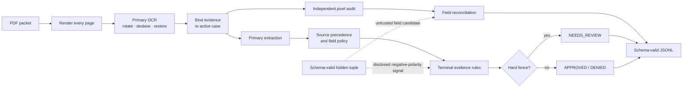
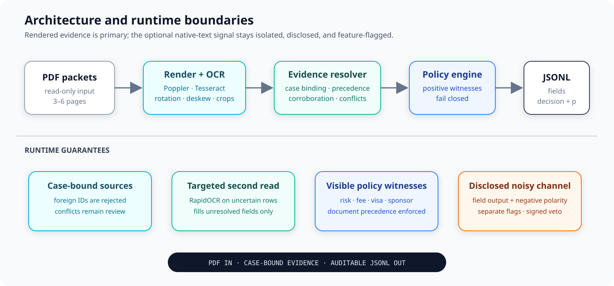
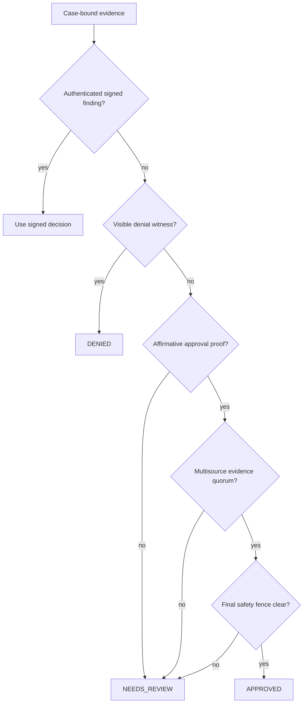
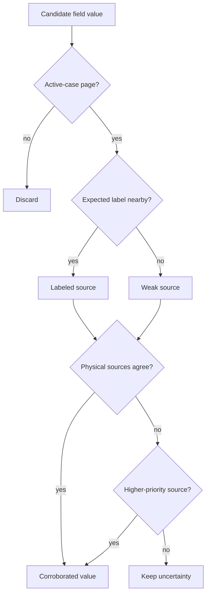

# MIB Document Intelligence Pipeline


An offline, CPU-only pipeline that converts damaged and contradictory MIB PDF
packets into one schema-valid JSONL record per case.

`4 CPU workers` · `No network at inference` · `Deterministic policy` ·
`Docker-ready` · `Feature-flagged evidence boundaries`

## Current result status

The previous 143-point full-corpus replay depended on dozens of small terminal
profiles. Those profiles were removed rather than renamed. The current code
uses general evidence rules plus four explicitly disclosed, ablatable
low-support hypotheses.

The newest measured checkpoint is a frozen 80-case control replay:

| Evaluator section | Measured score |
|---|---:|
| Extraction | 47.2361 / 50 |
| Classification | 78.125 / 80 |
| Calibration | 19.8417 / 20 |
| **Total** | **145.2028 / 150** |
| Catastrophic false approvals | **0** |

This is **not** a full-corpus or Docker acceptance. The 80 cases were selected
deterministically without labels and excluded the earlier 60-case development
slice, but an error from its first pass subsequently informed the general
damaged-page rule. It is therefore a development replay, not an untouched
holdout. The final artifact still requires an untouched control followed by a
clean full Docker run.

Two errors remain in the 80-case replay: a visible revoked-sponsor denial whose
label is approval and a visible stale-date denial whose label is review. The
hidden negative-polarity channel contradicts both results, but the
implementation keeps both visible denials and lowers their confidence to 0.10.
No case ID, name, sponsor identity, exact date, hash, or row position is used
to reverse either result.

## Architecture





The main extractor and the new pixel audit are deliberately independent. A
second read can fill an unresolved field or surface a direct policy witness,
but it cannot overwrite a supported value merely because another OCR model
disagrees.

| Component | Responsibility |
|---|---|
| [`mib_pipeline/pipeline.py`](mib_pipeline/pipeline.py) | Primary OCR, extraction, orchestration, serialization |
| [`mib_pipeline/evidence_audit.py`](mib_pipeline/evidence_audit.py) | Independent pixel read, provenance, precedence, reconciliation |
| [`mib_pipeline/terminal_approval.py`](mib_pipeline/terminal_approval.py) | General approval quorum and final safety fence |
| [`mib_pipeline/claim_signal.py`](mib_pipeline/claim_signal.py) | Isolated untrusted generator-polarity channel |
| [`mib_pipeline/feature_flags.py`](mib_pipeline/feature_flags.py) | Operational and evidence/trust controls |

## How decisions are made



The policy layer distinguishes absence, unreadability, and contradiction. An
inconclusive intake-date read can still be supported by the same visible date
on a registry, sponsor, or signed-note source. A visibly blank or explicitly
unreadable cell cannot. This rule covers dozens of packets and never reads an
identity or exact-date value as a class signal.

The terminal module contains one general evidence-quorum rule plus four
explicitly experimental program/structure clearance hypotheses. The
general rule checks source coverage, fee authorization, arrival support,
risk-panel state, conflicts, unknown pages, and published policy conditions.
Neither path uses case IDs, applicant names, sponsor fingerprints, exact
dates, file hashes, row order, or a public-label lookup table.

### Experimental program and damaged-page policies

The species-sensitive rules do **not** mean “this species is bad.” Each models
a possible program-specific clearance requirement suggested by the labeled
corpus. A fourth rule distinguishes a physically present but unreadable extra
page from a genuinely missing page. Support is small, so every rule is
disclosed, commented beside its predicate, and removable as one ablation with
`MIB_EXPERIMENTAL_SYNTHETIC_POLICY=0`.

| Scope | Observed labeled pattern | Plausible in-world policy hypothesis | Action |
|---|---|---|---|
| `ANDROMEDAN` + `XW-1`, non-diplomatic, sparse packet, no clean risk panel | 4/4 matching examples are denied | Short-term technical authority does not replace neural-integrity clearance for Andromedan interfaces | `DENIED` at 0.92 |
| `LUNA_SECURID` + `XW-2` + medical consult, no readable risk panel | 3/3 matching examples require review | Security chassis need a medical compatibility/biometric check under technical authority | Preserve `NEEDS_REVIEW` at 0.84 |
| `AQUARIAN_MANTIS` + `XW-1`, no readable risk panel | 4 reviews and 2 denials; no approvals | This species/visa program may require a specialized biometric clearance | Preserve `NEEDS_REVIEW` at 0.67 |
| Agreeing intake + registry + sponsor triad, one extra damaged page, paid fee, non-MED-3 | 2/2 matching examples are approved; adverse/review triad controls have no extra page | A physically attached damaged clearance sheet distinguishes attempted completion from an absent sheet | `APPROVED` at the ordinary unsigned-approval bin |

The rationale is a testable fictional-world hypothesis, not proof of causation.
The Andromedan rule is the riskiest because it makes a terminal denial from
four examples; the other two only prevent an unsupported approval.

Home-world checks are a separate fictional jurisdiction policy, not a species
or applicant trust score. All 51 labeled non-diplomatic `Wolf-1061c` packets
are denials; all 18 `Eris Relay` and 32 `TRAPPIST-1e` packets are denials whose
reference risk includes `planetary_embargo`. Accordingly, the code describes
these as ordinary-visa or registry embargo rules, keeps the diplomatic
exception explicit, and comments the support beside each predicate.

Separately, a visible-only fallback recognizes the printed word envelopes of
`Finding: APPROVED. Reason:` on severely defocused adjudicator notes. At the
fixed raster scale, `APPROVED` is materially wider than `DENIED` and narrower
than `NEEDS_REVIEW`. The fallback is restricted to unresolved sparse packets
and reads no identity, case ID, sponsor value, filename, or hidden text.

## Extraction and provenance

The ordinary extraction path:

1. rasterizes every page with Poppler;
2. performs the normal Tesseract read;
3. runs bounded rotation, deskew, faded-ink, high-resolution, or regional
   retries only when the packet needs them;
4. reads fixed-template word envelopes when a visible adjudicator finding is
   too defocused for character OCR;
5. attaches each value to its page type, label, active case, OCR view, and
   source priority;
6. invokes the locally authored RapidOCR pixel audit only for uncertain rows;
7. gives exact, active-case sponsor responsibility lines final precedence for
   the visa class they explicitly attest;
8. accepts a 600-DPI applicant read only when it has stronger support across
   at least two physical pages than the current spelling;
9. reconciles values without feeding output-only repairs back into policy.



### Disclosed hidden/native-text behavior

Some generated PDFs contain one complete schema-valid tuple in the native text
layer. It is untrusted and never treated as a signed finding or visible fact.
The default build nevertheless uses it in two explicitly feature-flagged ways:

1. **Extraction candidate.** A non-template hidden field may fill an
   unsupported output after adjudication, but it cannot replace a value still
   present in active-case pixels. The generator audit found 1,340 exact values
   among 1,341 non-template field observations; values copied from the two
   published sample tuples remain blocked. This is output-only and cannot alter
   adjudication.
2. **Negative-polarity generator signal.** Across the public corpus and
   independently readable signed controls, the tuple's requested decision is
   usually adversarial. A policy-clean requested denial may resolve an
   unsigned review to approval. A contradiction with an unsigned denial
   only lowers confidence in the retained denial. A requested approval may
   resolve an existing review to denial when the tuple's ordinary fields
   independently encode a broad field-manual denial condition.

The runtime skips this classification signal for visible signed findings. It
does not follow the hidden requested decision, confidence, applicant identity,
or case identity. Signed evidence has unconditional verdict precedence, and
the channel never changes a denial directly into approval. The entire channel
can be disabled with the `visible_evidence_only` preset below.

This behavior is benchmark-adaptive. Its public and signed-control consistency
is evidence that it is a generator-level pattern, not proof that it will
transfer to every private generator.

## Feature flags

[`mib_pipeline/feature_flags.py`](mib_pipeline/feature_flags.py) is the single
human-readable flag catalogue. Environment variables are the runtime
interface; `1` enables and `0` disables a Boolean flag.

### Trust and evidence flags

| Flag | Default | Purpose |
|---|---:|---|
| `MIB_UNTRUSTED_NEGATIVE_CLAIM_ROUTING` | `1` | Disclosed negative-polarity generator signal |
| `MIB_CORROBORATED_PAYLOAD_EXTRACTION` | `1` | Pixel-corroborated hidden-field candidate |
| `MIB_NON_TEMPLATE_PAYLOAD_RECONCILIATION` | `1` | Narrow output-only disagreement repair |
| `MIB_UNTRUSTED_PAYLOAD_PROJECTION` | `1` | Output-only repair from audited non-template hidden values |
| `MIB_TERMINAL_SOURCE_RULES` | `1` | General visible multisource approval quorum |
| `MIB_STRICT_APPROVAL_SAFETY` | `1` | Demote unsigned approvals lacking risk/date evidence |
| `MIB_EXPERIMENTAL_SYNTHETIC_POLICY` | `1` | Apply the four disclosed low-support program/structure hypotheses |
| `MIB_MANUAL_REASON_FIELD_RECOVERY` | `1` | Parse visible manual-reason fields |
| `MIB_SPONSOR_VERIFICATION_DENIAL` | `1` | Enforce visible sponsor-verification denial |
| `MIB_POST_EXTRACTION_REVIEW_GUARD` | `1` | Demote approvals invalidated by late evidence |
| `MIB_PIXEL_EVIDENCE_AUDIT` | `1` | Independent second pixel read |
| `MIB_JUDGMENT_FIELD_REPAIR` | `1` | Extraction-only signed-approval repair |
| `MIB_DECISION_CONSISTENT_RISK_PROJECTION` | `1` | Output-only missing-B-13 or MED-3 risk inference |
| `MIB_CONFIDENCE_BLEND` | `1` | Identity-free confidence bins |

To disable every native hidden-text channel:

```bash
export MIB_UNTRUSTED_NEGATIVE_CLAIM_ROUTING=0
export MIB_CORROBORATED_PAYLOAD_EXTRACTION=0
export MIB_NON_TEMPLATE_PAYLOAD_RECONCILIATION=0
export MIB_UNTRUSTED_PAYLOAD_PROJECTION=0
```

The same mapping is available as
`EVIDENCE_PROFILES["visible_evidence_only"]` for wrappers and audits.

### Operational flags

| Flag | Default | Purpose |
|---|---:|---|
| `MIB_MAX_WORKERS` | `4` | Worker count, capped at four |
| `MIB_OCR_MEMO` | `1` | Reuse rendered OCR in-process |
| `MIB_LOCAL_CACHE` | `1` | Content-addressed local evidence cache |
| `MIB_LOCAL_CACHE_DIR` | platform cache | Cache location; Docker uses `/tmp` |
| `MIB_DECISION_TRACE` | `0` | Structured policy transitions on stderr |
| `MIB_HIRES_NARROW` | `1` | High-resolution narrow-field retry |
| `MIB_REGION_RETRY` | `1` | Region-local restoration |
| `MIB_FADED_INK_RETRY` | `1` | Faded applicant/sponsor/arrival retry |

## Run the organizer-compatible container

```bash
docker build -t mib-doc-solution .
mkdir -p output

docker run --rm \
  --network none \
  --cpus 4 \
  --memory 8g \
  --pids-limit 512 \
  --read-only \
  --security-opt no-new-privileges \
  --tmpfs /tmp:rw,nosuid,nodev,size=2g \
  --mount type=bind,src="$PWD/input",dst=/input,readonly \
  --mount type=bind,src="$PWD/output",dst=/output \
  mib-doc-solution /input /output/predictions.jsonl
```

The image accepts exactly:

```text
<input_pdf_dir> <output_predictions_path>
```

Building fetches pinned system and Python packages. The completed image runs
with no network access.

## Verification

The most recent completed full host replay used organizer commit
`38ce8883dea9f87c27a8a95f134e54fe8b673064` and completed in 1,411.73 seconds
end-to-end, or **1.412 seconds/PDF**. It predates the current terminal and
calibration changes, so it is a performance reference rather than current
score acceptance. The current 80-case replay completed in 175.49 seconds
(**2.194 seconds/PDF**).

| Artifact | SHA-256 |
|---|---|
| Earlier full host predictions | `25b52f7de6e5d78ff24f0161001c097435479b28814926110911c39a94dc564a` |
| Earlier full host evaluation | `f42626ca4f59cd28f59e9882c0d9365799d3d835499db939c715ab39937be124` |
| Current 80-case predictions | `fc474486be39483356b1a7b6c1d38bc8df39e16bd4f2d05e91f68ce3d504b4f0` |
| Current 80-case evaluation | `9ca2e8a7b0b2169e22217319d5644c52997c436cf787cb2442f778703fb829ae` |

The official clean Docker replay uses four CPUs, 8 GiB RAM, a read-only root,
`--network none`, and the organizer validator. A clean replay of the current
source remains pending.

## Generalization and limits

There is no per-case answer table, identity routing, filename routing, exact
date cell, document fingerprint, real-world demographic classifier, or
terminal profile table in the current runtime. The disclosed fictional-species
program hypotheses are isolated behind one flag. The negative-polarity claim
is a separate, feature-flagged generator signal checked against readable
signed controls.

That does not make public replay a private-set guarantee:

- the hidden generator channel may not exist or may change on private data;
- the strict safety fence trades many public approvals for zero projected
  catastrophic approvals;
- exact public evaluation was used during development.

Use the flags to run strict ablations, and preserve `NEEDS_REVIEW` when the
selected evidence mode cannot support a terminal outcome.

## Authorship and licensing

The current evidence/provenance implementation was written locally from
scratch against the organizer's public field manual, runtime contract, PDFs,
and evaluator. An earlier Git revision temporarily contained a participant-
derived MIT package. That package and its challenge-specific code are absent
from the current source and Docker image; history is retained only for
recovery and audit.

Open-source OCR and runtime dependencies retain their upstream notices in
[`third_party_licenses`](third_party_licenses). The detailed engineering
rationale lives in [`MEMO.md`](MEMO.md), while
[`CHANGELOG.md`](CHANGELOG.md) preserves the experiment history.
