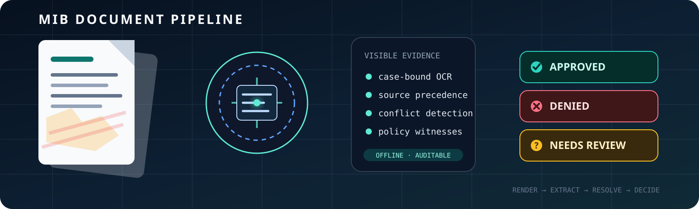
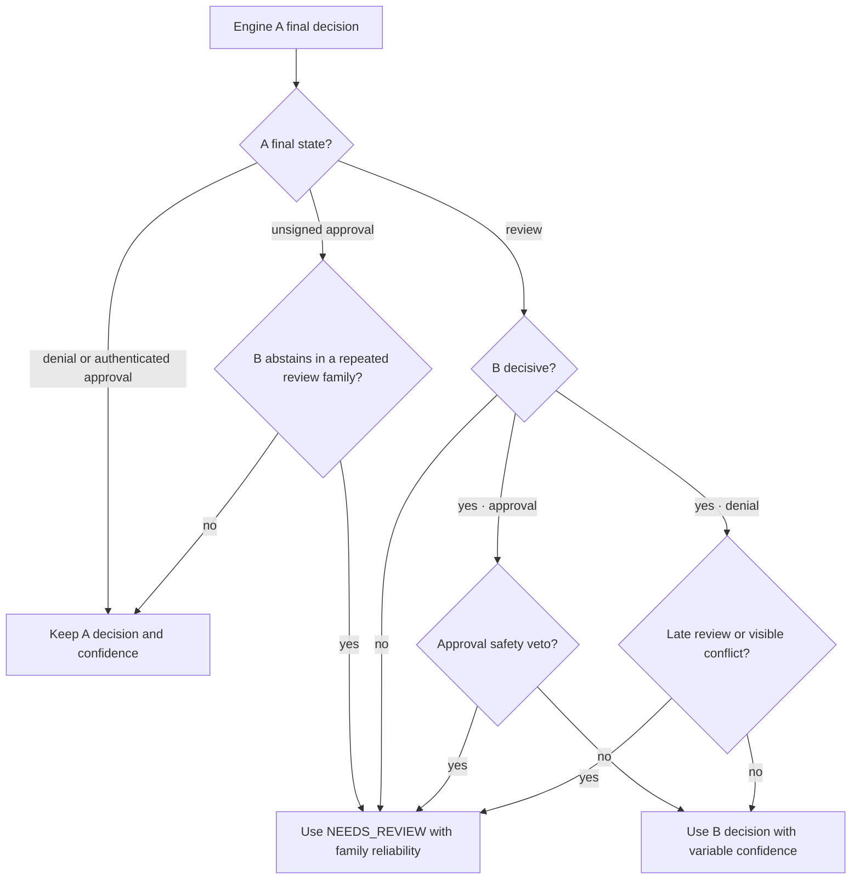

# MIB Document Intelligence Pipeline



An offline, CPU-only system that turns damaged, contradictory MIB PDF packets
into schema-valid JSONL. It combines case-bound OCR, explicit source
provenance, fail-closed policy rules, and a conservative dual-engine
classifier.

`4 CPU workers` · `no runtime network` · `read-only-root compatible` ·
`deterministic output` · `feature-flagged trust boundaries`

## Release status

The default configuration is the submission candidate:

- **Engine A** is the primary generalized evidence engine.
- **Engine B** is a public-training second opinion and is **on by default**.
- Engine B cannot override an Engine-A denial or authenticated approval.
- A decisive Engine-B result may resolve an Engine-A `NEEDS_REVIEW`.
- In repeated identity-free source-program families, B abstention may demote
  an unsigned A approval to review; it can never turn it into a denial.
- A B approval must pass the ordinary field checks and every hard safety veto;
  a B denial is also blocked by late packet-local review evidence or a visible
  decision conflict.
- `MIB_BENCHMARK_FIT_CLASSIFIER=0` produces Engine-A-only behavior.

The current arbiter recovers more of Engine B's useful review resolution than
the previous tie-breaker, while retaining explicit approval vetoes. The older
unrestricted replay measured 146.5924/150 on the public 1,000, but it is
deliberately **not** a score claim for the current source. It remains an audit
artifact and an upper reference for the public-fit branch.

### Measurement ledger

| Candidate / evaluation boundary | Extraction | Classification | Calibration | Total | CFA |
|---|---:|---:|---:|---:|---:|
| Conservative default, public 1,000 candidate replay | 46.9478 | 73.4800 | 17.7769 | **138.2047** | 0 |
| Generalized Engine A, development 800 | 46.9028 | 73.4500 | 17.8758 | **138.2286** | 0 |
| Frozen aggregate-only 200 | 46.7389 | 71.5000 | 16.9360 | **135.1749** | 0 |
| Superseded aggressive bridge, public 1,000 artifact replay | 46.6956 | 79.9400 | 19.9568 | **146.5924** | 0 |

The 200 boundary exposed aggregate scores only; its PDFs, predictions,
per-case errors, confusion cells, and traces were not used for rule discovery.
The conservative-default row starts from a fresh constrained 1,000-case Docker
run and deterministically replays the two rows changed by the final broad
safety patch; both changed routes were rerun end to end as exact controls. It
is not represented as a second full Docker run. The aggressive bridge row is
an older artifact replay, not the current default. Historical experiments live
in [CHANGELOG.md](CHANGELOG.md), while the active promotion protocol lives in
[RULES.md](RULES.md).

## Architecture


Both engines consume the same extracted record, but they do not share a
decision:

1. Pages are rendered and OCR'd.
2. Evidence is bound to the active case and stored with source provenance.
3. Engine A decides from signed findings, visible denial witnesses,
   multisource approval support, and explicit uncertainty fences.
4. Engine B starts from `NEEDS_REVIEW` and independently evaluates the shared
   fields with its public-training model and residual policy rules.
5. The arbiter applies the conservative agreement contract.
6. Extraction-only reconciliation runs behind the frozen decision boundary.
7. One JSON object is written per case.

### Arbiter contract



A decisive bridge starts only from Engine A's explicit abstention. A B approval requires
a complete emitted core record, an authorized fee state, no emitted risk, and
no visible decision conflict. Positive risk evidence, unknown fee, explicitly
missing medical clearance, incomplete recovered authority, and a late
pixel-visible review fence are absolute vetoes. A B denial cannot create a
catastrophic false approval, but it is still blocked when a visible decision
conflicts or late evidence says the packet must remain under review. The one
reverse route is fail-closed: when B abstains and an unsigned A approval falls
inside a repeated identity-free source-program family, the arbiter uses
review. The high-precision development family is 7/7 review across folds; the
mixed family is 4/6, so their confidences are 0.88 and 0.60 respectively.

Bridge confidence is not a vote count. A and B consume overlapping fields, so
their probabilities are correlated. The arbiter uses a correlation-discounted
blend of A reliability, B strength, and evidence-gap reliability, subtracts an
approval-risk margin, and caps the result below authenticated findings. This
replaces the previous fixed 0.90 and produces bounded values from 0.62 to
0.93; 0.99 or 1.00 would claim a reliability the bridge has not demonstrated.

This makes Engine B an abstention resolver and a narrow fail-closed review
check, not a replacement for Engine A's evidence decisions. If Engine B fails
or is disabled, Engine A output is preserved.

## Extraction and evidence

The extractor distinguishes a value from the way it was observed. A record
may therefore carry:

- the OCR value;
- physical page and page type;
- active-case binding;
- labeled-row versus incidental-text support;
- one-source versus multisource agreement;
- readable, unreadable, absent, or conflicting state;
- ordinary, rotated, deskewed, faded-ink, or high-resolution read provenance.

That state is more useful than raw text alone. For example, an unreadable
arrival row is not the same as a missing arrival page, and an intake value
repeated by a sponsor is stronger than the same string found in policy prose.

The main components are:

| Component | Responsibility |
|---|---|
| [pipeline.py](mib_pipeline/pipeline.py) | rendering, OCR, extraction, orchestration, JSONL |
| [evidence_audit.py](mib_pipeline/evidence_audit.py) | independent pixel read, source binding, reconciliation |
| [terminal_approval.py](mib_pipeline/terminal_approval.py) | Engine A policy, approval quorum, final safety |
| [benchmark_fit_classifier.py](mib_pipeline/benchmark_fit_classifier.py) | Engine B and conservative arbiter |
| [claim_signal.py](mib_pipeline/claim_signal.py) | isolated untrusted generator-signal channel |
| [feature_flags.py](mib_pipeline/feature_flags.py) | complete operational and evidence flag catalogue |
| [local_cache.py](mib_pipeline/local_cache.py) | content-addressed, process-local evidence cache |

## Trust boundaries


Visible active-case pixels have the highest authority. Native PDF text is
treated as untrusted because the challenge corpus contains hidden instructions,
fake answer-key tuples, and off-crop content.

The default does use selected native-text channels, but under narrow contracts:

- a native value may denoise or fill an unresolved output field;
- visible supported values always win;
- native-field reconciliation happens after adjudication is frozen;
- the negative-polarity generator signal is isolated and feature-flagged;
- native text cannot overwrite an authenticated signed finding;
- every path can be disabled without editing source.

Public labels are a separate boundary. Engine B was trained locally on the
1,000 public training labels and uses document topology, low-cardinality field
cells, name shape, sponsor-number shape, and two generated CatBoost heads.
There is no case-ID answer table or manual output-row editing. Nevertheless,
Engine B is benchmark-adaptive and private transfer is unproven; that is why it
is quarantined behind one flag and given only a corroborating vote.

## Feature flags

All defaults and descriptions live in
[feature_flags.py](mib_pipeline/feature_flags.py). Invalid Boolean values fail
fast instead of silently choosing a mode.

### Primary profiles

| Profile | Configuration | Purpose |
|---|---|---|
| Default conservative dual engine | no environment changes | Engine A + corroborating Engine B |
| Generalized only | `MIB_BENCHMARK_FIT_CLASSIFIER=0` | remove public-fit Engine B |
| Visible evidence only | use `EVIDENCE_PROFILES["visible_evidence_only"]` | disable Engine B, native-text channels, and experimental policy |
| Experimental signals off | use `EVIDENCE_PROFILES["experimental_signals_off"]` | retain ordinary extraction while removing benchmark-fit and synthetic signals |

### High-impact evidence controls

| Variable | Default | Effect |
|---|---:|---|
| `MIB_BENCHMARK_FIT_CLASSIFIER` | **1** | run Engine B and the conservative arbiter |
| `MIB_STRICT_APPROVAL_SAFETY` | 1 | demote unsupported unsigned approvals |
| `MIB_MED3_ABSENT_BIOMETRIC_REVIEW` | 1 | require affirmative MED-3 biometric clearance |
| `MIB_TERMINAL_SOURCE_RULES` | 1 | enable the multisource approval quorum |
| `MIB_PIXEL_EVIDENCE_AUDIT` | 1 | run the independent pixel evidence pass |
| `MIB_UNTRUSTED_NEGATIVE_CLAIM_ROUTING` | 1 | enable the isolated generator-polarity signal |
| `MIB_CORROBORATED_PAYLOAD_EXTRACTION` | 1 | allow pixel-corroborated native-field denoising |
| `MIB_UNTRUSTED_PAYLOAD_PROJECTION` | 1 | fill only final unresolved output fields |
| `MIB_EXPERIMENTAL_APPROVAL_QUORUM` | 1 | enable the disclosed source-topology hypotheses |
| `MIB_CONFIDENCE_BLEND` | 1 | apply identity-free output calibration |
| `MIB_CONFIDENCE_POST_BLEND_PLATT` | 1 | apply the selected monotone confidence map |

### Operational controls

| Variable | Default | Effect |
|---|---:|---|
| `MIB_MAX_WORKERS` | 4 | packet workers, capped at four |
| `MIB_LOCAL_CACHE` | 1 | content-addressed evidence cache |
| `MIB_LOCAL_CACHE_DIR` | platform cache | cache location; Docker uses `/tmp` |
| `MIB_OCR_MEMO` | 1 | reuse rendered OCR in one process |
| `MIB_HIRES_NARROW` | 1 | bounded high-resolution field retry |
| `MIB_REGION_RETRY` | 1 | unresolved-region restoration |
| `MIB_FADED_INK_RETRY` | 1 | faded-row recovery |
| `MIB_DECISION_TRACE` | 0 | structured decision events on stderr |

The source catalogue contains every remaining fine-grained switch; the tables
above are the controls most useful to reviewers and operators.

## Build and run

```bash
docker build -t mib-doc-solution .

mkdir -p output
docker run --rm \
  --network none \
  --cpus 4 \
  --memory 8g \
  --pids-limit 512 \
  --read-only \
  --security-opt no-new-privileges \
  --tmpfs /tmp:rw,nosuid,nodev,size=2g \
  --mount type=bind,src="$PWD/input",dst=/input,readonly \
  --mount type=bind,src="$PWD/output",dst=/output \
  mib-doc-solution /input /output/predictions.jsonl
```

The image accepts exactly:

```text
<input_pdf_dir> <output_predictions_path>
```

Building requires package access. The completed image runs CPU-only with no
network, API key, cloud OCR, LLM, VLM, or external service.

To compare Engine A alone:

```bash
docker run --rm --network none \
  -e MIB_BENCHMARK_FIT_CLASSIFIER=0 \
  --mount type=bind,src="$PWD/input",dst=/input,readonly \
  --mount type=bind,src="$PWD/output",dst=/output \
  mib-doc-solution /input /output/predictions-generalized.jsonl
```

## Organizer-compatible verification

From the organizer repository:

```bash
python3 scripts/run_docker_submission.py \
  --repo /path/to/mib-doc-challenge-solution \
  --input-dir data/train \
  --output /tmp/mib-output/predictions.jsonl \
  --manifest data/train_labels.csv \
  --timeout-seconds 6000

python3 scripts/validate_submission.py \
  --submission /tmp/mib-output/predictions.jsonl \
  --manifest data/train_labels.csv
```

The organizer contract verified on August 2, 2026 remains:

- exactly two runtime arguments;
- network disabled;
- CPU-only, 4 vCPU, 8 GiB;
- read-only input and root filesystem;
- writable output and `/tmp`;
- at most 6 seconds per PDF on average;
- at most 4 GiB uncompressed image size;
- no individual model over 250 MiB and no more than 1 GiB total model data.

The upstream challenge core is still commit `38ce8883`; the organizer rules,
schema, evaluator, and Docker runner have not changed since the prior audit.
The exact constrained runner processed the full public 1,000 in 3,546 seconds:
**3.546 seconds/PDF total** across primary OCR, selective RapidOCR audit,
extraction repair, both classifiers, arbitration, calibration, and JSONL
writing. All 1,000 rows were valid and complete. That run exposed two
catastrophic false approvals: one late extraction repair bypassed an existing
embargo invariant, and one unsigned Engine-A approval contradicted Engine B's
denial. The final patch re-applies the existing embargo guard after extraction
freeze and converts the latter disagreement only to review. Exact constrained
controls confirmed both transitions, and a deterministic two-row replay of the
full artifact scores 46.9478 extraction, 73.4800 classification, 17.7769
calibration, **138.2047 total, and 0 CFA**.

The same frozen image then processed the organizer's complete 5,000-packet
validation directory under the identical constrained contract. It emitted
**5,000 unique, schema-valid rows with zero missing or extra case IDs**. The
container-start-to-artifact wall clock was 17,682.5 seconds, or **3.5365
seconds/PDF total**, including primary OCR, the 4,022-packet selective audit,
extraction repair, both classifiers, arbitration, calibration, and JSONL
writing. The validator reran successfully against
`data/validation_manifest.csv`. The final validation artifact is 1,754,045
bytes with SHA-256
`64c39e664ad3990f969ef18bb8fd3245d5238375c9098fce9ce30752ce703dc2`.

The final ARM64 image is 217,916,620 bytes (0.20 GiB). The full-run prediction
SHA-256 is `f8829b96111c7907eaa33f33c1560548c9195fa244dd812f696ccc86de055b4a`;
the final-candidate replay and evaluation SHA-256 values are
`a83ac07eedccd59928a2eb2d452fe213568f1ee6ef9c63dbe445eca0d6457cb5`
and `ef2cb22643daf69641921636b678e09be1673f2f142907ca16d936b7b5b9df62`.
The earlier cold 50-packet release check ran at 4.34 seconds/PDF and the prior
200-packet check at 3.551 seconds/PDF; none is private-score evidence.

## Generalization and compliance

Engine A contains no case-ID, filename, row-order, applicant-name, exact-date,
hash, or image-fingerprint decision feature. Manual and learned Engine-A work
follows the 800-development / aggregate-only-200 protocol in
[RULES.md](RULES.md).

Engine B intentionally has a different disclosure:

- it was fit on all 1,000 public training cases;
- it uses public-label correlations that may not transfer;
- it includes name and sponsor **shape** features and small policy cells;
- it contains no validation answer file, case-ID lookup, or per-row output map;
- the two exported model heads are static offline code;
- the conservative arbiter prevents it from acting without Engine-A support.

The organizer explicitly permits candidate-trained models and hand-written
rules, but the private set and code review decide whether those choices
generalize. The repository therefore reports public replay as public replay,
not as private acceptance proof.

## Authorship and licensing

The active pipeline, evidence audit, bridge integration, residual rules, and
documentation were written locally against the organizer's public repository
and dataset. No participant PR or participant challenge solution is present in
the current source or Docker image. The generated Engine-B heads were recovered
from this repository's own history and were originally trained locally.

Third-party components are limited to ordinary open-source runtime libraries
and OCR/model tooling. Their notices are preserved in
[third_party_licenses](third_party_licenses), including CatBoost Apache-2.0,
RapidOCR, PaddleOCR model provenance, ONNX Runtime, OpenCV/FFmpeg, and Shapely/
GEOS obligations.

## Submission checklist

- [x] public solution repository with root Dockerfile
- [x] exact two-argument entrypoint
- [x] offline CPU runtime
- [x] pinned Python dependency closure with hashes
- [x] source and model license notices
- [x] no private labels or validation-answer artifact in the image
- [x] no case-ID answer table or manual prediction editing
- [x] trust and benchmark-fit disclosures
- [x] concise 1–2 page [MEMO.md](MEMO.md)
- [x] organizer source refreshed and contract re-read
- [x] constrained ARM64 full 1,000 run, score, CFA repair, and schema checks
- [x] clean AMD64 cross-build and emulated entrypoint check
- [x] generate and validate the final 5,000-row validation `predictions.jsonl`
- [x] copy predictions, memo, and solution link into
      `submissions/midasavocado/`
- [ ] submit the form and open the organizer pull request

The remaining item is an external submission action and is deliberately left
for the participant instead of being hand-waved into a green checkmark.
