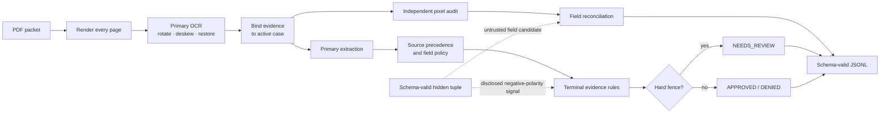
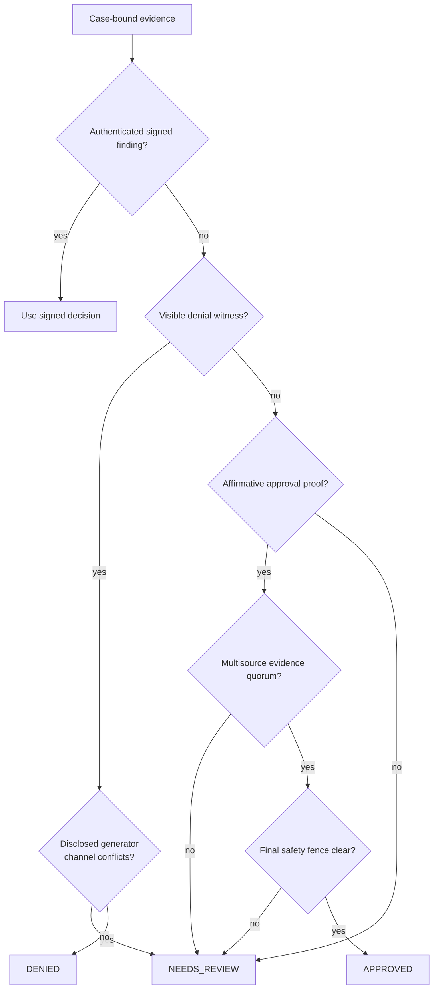
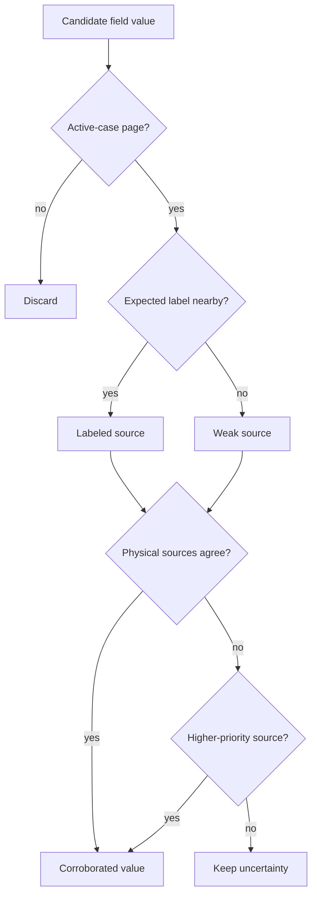

# MIB Document Intelligence Pipeline


An offline, CPU-only pipeline that converts damaged and contradictory MIB PDF
packets into one schema-valid JSONL record per case.

`4 CPU workers` · `No network at inference` · `Deterministic policy` ·
`Docker-ready` · `Feature-flagged evidence boundaries`

Development and promotion are governed by the stricter
[`RULES.md`](RULES.md) contract. New manual patterns use only a frozen 800-row
development set; learned components additionally require five internal
640/160 folds inside those 800 rows. The original 200-row validation partition
has been evaluated once and is now spent; it cannot select later changes.

## Current result status

The latest exact full 800-case replay measured:

| Evaluator section | Exact development score |
|---|---:|
| Extraction | 47.0556 / 50 |
| Classification | 78.5000 / 80 |
| Calibration | 19.6009 / 20 |
| **Total** | **145.1564 / 150** |
| Catastrophic false approvals | **0** |
| Valid / expected rows | **800 / 800** |

The exact confusion contains 203 correct approvals, 350 correct denials, and
227 correct reviews. The remaining 20 errors are conservative abstentions:
20 approvals were sent to review. No denial or review was approved. The
earlier frozen candidate was evaluated once on the 200-case
validation partition: **46.8111 extraction, 72.5500 classification, 17.1061
calibration, 136.4672 total, and 3 catastrophic false approvals**. Because that
aggregate result was discussed, the partition is spent and is not used to
select current changes. Complete support, controls, rejected experiments,
split commitments, and the boundary disclosure are in [`RULES.md`](RULES.md).

The preceding 145.0510 safety-baseline replay was byte-for-byte stable after
the Docker scheduling work. This candidate differs from that artifact in one
row: a visibly sourced technical-medical packet without B-13 clearance moves
from review to denial. The two Docker-specific false approvals found on a
200-row development-only runtime slice were removed with general evidence
invariants: categorical program predicates must be visible, and an
authenticated 0.99 review cannot be reopened by a synthetic program rule.

The decision layer uses visible/source-bound evidence rules plus explicitly
disclosed, jointly ablatable fictional-program hypotheses. It contains no
case-ID, filename, applicant-name, row-order, hash, image-fingerprint, or
answer-table adjudication feature. Low-support hypotheses remain disclosed as
transfer risks rather than being promoted into universal facts.

For historical context, a rejected broad safety fence scored 128.6496 on a
cold constrained 1,000-PDF Docker replay. It removed five catastrophic false
approvals but incorrectly demoted 124 true approvals, so that fence is not the
current policy. The historical result remains in [`CHANGELOG.md`](CHANGELOG.md)
instead of being presented as the current score.

## Architecture




The main extractor and the new pixel audit are deliberately independent. A
second read can fill an unresolved field or surface a direct policy witness,
but it cannot overwrite a supported value merely because another OCR model
disagrees.

After the verdict is final, one cross-field invariant removes an unsupported
late risk guess from an approval when the pixel audit observed no positive risk
row. An approved record cannot simultaneously claim an inferred review-only
risk. This extraction-only repair changes neither adjudication nor confidence.

| Component | Responsibility |
|---|---|
| [`mib_pipeline/pipeline.py`](mib_pipeline/pipeline.py) | Primary OCR, extraction, orchestration, serialization |
| [`mib_pipeline/evidence_audit.py`](mib_pipeline/evidence_audit.py) | Independent pixel read, provenance, precedence, reconciliation |
| [`mib_pipeline/terminal_approval.py`](mib_pipeline/terminal_approval.py) | General approval quorum and final safety fence |
| [`mib_pipeline/claim_signal.py`](mib_pipeline/claim_signal.py) | Isolated untrusted generator-polarity channel |
| [`mib_pipeline/feature_flags.py`](mib_pipeline/feature_flags.py) | Operational and evidence/trust controls |

## How decisions are made



The policy layer distinguishes absence, unreadability, and contradiction. An
inconclusive intake-date read can still be supported by the same visible date
on a registry, sponsor, or signed-note source. A visibly blank or explicitly
unreadable cell cannot. This rule covers dozens of packets and never reads an
identity or exact-date value as a class signal.

The terminal module contains general evidence quorums plus a disclosed
experimental fictional-program layer. Ordinary unsigned recovery requires
visible fee, arrival, core-field, and risk authority. One separately flagged
inverse-generator family is an explicit exception: policy-clean requested
denials are 25/25 approvals across all five development folds and 37/37 on
independent controls, so the default mode accepts that family as alternate
authority after excluding signed findings, positive visible denial witnesses,
and emitted risk flags. A generator/visible conflict can only abstain to
`NEEDS_REVIEW`; it never creates an approval. Neither layer uses case IDs,
applicant names, sponsor fingerprints, exact dates, hashes, row order, or an
answer table.

### Experimental program and damaged-page policies

The species-sensitive rules do **not** mean “this species is bad.” Each models
a possible program-specific clearance requirement suggested by the 800-case
development corpus. Support is small, so every rule is disclosed, commented
beside its predicate, and removable as one ablation with
`MIB_EXPERIMENTAL_SYNTHETIC_POLICY=0`.

| Scope | Observed labeled pattern | Plausible in-world policy hypothesis | Action |
|---|---|---|---|
| `ANDROMEDAN` + `XW-1`, non-diplomatic, sparse packet, no clean risk panel | 4/4 matching examples are denied | Short-term technical authority does not replace neural-integrity clearance for Andromedan interfaces | `DENIED` at 0.92 |
| `LUNA_SECURID` + `XW-2` + medical consult, no readable risk panel | 3/3 matching examples require review | Security chassis need a medical compatibility/biometric check under technical authority | Preserve `NEEDS_REVIEW` at 0.84 |
| `AQUARIAN_MANTIS` + `XW-1`, no readable risk panel | 4 reviews and 2 denials; no approvals | This species/visa program may require a specialized biometric clearance | Preserve `NEEDS_REVIEW` at 0.67 |
| `ARCTURIAN` + xenobotany, no readable risk panel | 3/3 matching examples require review across three folds | Botanical handling needs a biological-clearance channel | Preserve `NEEDS_REVIEW`; ordinary Arcturian work is deliberately outside the rule |
| `VENUSIAN_MYCELIAL` + archive audit, no readable risk panel | 6 denials and 2 reviews; no approvals | Archive work may need a contamination/identity clearance that intake and registry pages cannot replace | Preserve `NEEDS_REVIEW`; the pattern does not prove a specific denial cause |
| `ALPHA_DRACONIAN` + research, sparse fee/intake/registry packet | 2/2 matching examples require review in separate folds | Research needs an independent biometric or sponsor authority | Preserve `NEEDS_REVIEW`; richer Alpha packets are controls and remain untouched |
| Sirius Outpost + `MED-3`, paid fee/intake/registry packet, no readable risk panel | 3 denials and 1 review; no approvals | The local registry interface does not replace MED-3 biological clearance | Preserve `NEEDS_REVIEW`; a waived field-repair approval is the nearby counterexample |
| `AQUARIAN_MANTIS` at Proxima-b, sparse fee/intake/registry packet | 2/2 matching examples require review in separate folds | The local program needs a biometric or sponsor authority | Preserve `NEEDS_REVIEW`; richer source layouts are excluded |
| Gliese-581g registry packet without a sponsor source | 4 matching denials and no approvals after the documented controls | The fictional jurisdiction requires a current sponsor attestation in addition to intake and registry | May infer `DENIED` at 0.80; biometric, note, sponsor, and sponsor-contest controls veto |
| Jovian gas form at Titan Freeport with fee authority | 5/5 approvals across four folds | Titan operates an electronic gas-form corridor | May propose approval, but the universal recovered-approval evidence contract still applies |
| `JOVIAN_GASFORM` distributed interface | 11/11 approvals across all five folds | Gas-form packets can carry authorization through a monotone distributed-source interface | Approve only with complete alternate authority; technical-medical and sparse diplomatic-xenobotany states veto alongside risk, contest, unknown-page, and visible-decision states |
| DIP-1 reactor maintenance with a visible multi-source waiver | One residual recovery; independent support still limited | A visible diplomatic waiver can supply fee authority for critical reactor work | Approve only with visibly sourced DIP-1, visible waiver, supported arrival, at least three source types, and complete alternate authority |
| MED-3 reactor packet with intake+registry only | 2/2 denials across two development folds | Medical authority plus no fee, sponsor, or biometric channel cannot authorize reactor work | Deny only when both program facts are visibly sourced and there is no decision, contest, unknown page, or alternative source channel |
| `SIRIUS_AVIAN` with a visible waiver under `MED-3` or `TRANSIT-7` | 4/4 denials across four folds | The fictional avian medical/transit program is ineligible for this waiver interface | Deny from visibly sourced species, visa, and waiver; ordinary avian packets are untouched |
| `XW-2` with an authorized waiver but no sponsor source | 5/5 denials, one in every fold | Extended technical work still needs an attested sponsor assumption even when the fee is waived | Deny only with visible visa/waiver, no risk/contest/unknown-page uncertainty, and no sponsor source |
| Barnard-c with all five ordinary source types | 4/4 approvals across three folds | Redundant five-source authority can tolerate an ancillary damaged read | May propose approval; mandatory risk, fee, arrival, and core-field checks still veto |
| Zeta Reticuli with three-source distributed authority and complete visible fields | 3/3 approvals across three folds | Zeta's registry network can carry payment/risk authority when the whole active-case packet is visibly complete | May propose approval; LUNA `XW-2` medical consult remains review because it independently requires biometric clearance |
| Visibly sourced `XW-1`/`XW-2` medical consult with visible fee + intake + registry but no B-13 | 4/4 unresolved packets are denials across three folds after stronger-interface controls | A visibly read paid or waived status establishes payment state, not medical biometric clearance | May deny at 0.80; visible Alpha Draconian, Andromedan, and LUNA interfaces plus the complete paid Jovian/Titan interface veto; authenticated findings, notes, audit uncertainty, contests, unknown pages, and every nonmatching topology are excluded |

The rationale is a testable fictional-world hypothesis, not proof of causation.
The Andromedan denial remains the riskiest small cohort. Program approval
predicates are proposals only; the final source-completeness fence is not
ablatable and runs after recovery.

The important distinction is between a category and the paperwork program it
selects. The code never reasons “species X is bad.” It reasons “the visible
species/home-world plus visa and purpose select program X; this packet then has
or lacks program X's required authority.” Mixed adverse cohorts stay in
`NEEDS_REVIEW`; they are not upgraded to denial merely because several members
were denied.

Code comments use the same three-part disclosure beside each categorical
predicate: the complete observed cohort, the plausible fictional document or
clearance mechanism, and the independent veto or conservative outcome. Words
such as “treaty,” “corridor,” and “interface” describe benchmark paperwork—not
an inherent moral, safety, or trust characteristic of a species or resident.

Home-world checks are a separate fictional jurisdiction policy, not a species
or applicant trust score. All 44 labeled non-diplomatic `Wolf-1061c` packets
in the development 800 are denials; all 12 `Eris Relay` and 26 `TRAPPIST-1e`
development packets are denials whose
reference risk includes `planetary_embargo`. Accordingly, the code describes
these as ordinary-visa or registry embargo rules, keeps the diplomatic
exception explicit, and comments the support beside each predicate.

The final approval fence is broader and does not use species at all. A generic
hidden/native extraction candidate cannot prove fee authorization or any
other mandatory channel. The one inverted-generator exception is structurally
marked and ablatable; all other hidden extraction runs after adjudication and
cannot reach policy. This is intentionally aggressive benchmark adaptation,
not a claim that hidden text is visible evidence.

The MED-3 rule is narrower. Across the 233 labeled MED-3 development packets,
the audit finds 4 explicitly missing B-13 panels and all 4 are denials. Merely absent or
unreadable panels also contain approvals, so those broader states do not
trigger this fence. Finally, a visibly `COPY`/`FILED`/`ARCHIVE`-stamped intake
is treated as historical: if it is the only source for a non-diplomatic visa
attached to a waiver, the packet stays in review because a clean B-13
establishes biometric safety, not current visa authority. The stamps never
prove denial.

Separately, a visible-only fallback reads severely defocused adjudicator notes.
It requires the active-case manual-note header, a Reason row, an unambiguous
fuzzy finding, and the same decision at 150 and 200 DPI. The complete eight-page
candidate cohort produced one additional approval read and seven abstentions,
with no false read. It uses no identity, sponsor value, filename, or hidden
text.

## Extraction and provenance

The ordinary extraction path:

1. rasterizes every page with Poppler;
2. performs the normal Tesseract read;
3. runs bounded rotation, deskew, faded-ink, high-resolution, or regional
   retries only when the packet needs them;
4. reads fixed-template word envelopes when a visible adjudicator finding is
   too defocused for character OCR;
5. attaches each value to its page type, label, active case, OCR view, and
   source priority;
6. invokes the locally authored RapidOCR pixel audit only for uncertain rows;
7. gives exact, active-case sponsor responsibility lines final precedence for
   the visa class they explicitly attest;
8. accepts a 600-DPI applicant read only when it has stronger support across
   at least two physical pages than the current spelling;
9. reconciles values without feeding output-only repairs back into policy.



### Disclosed hidden/native-text behavior

Some generated PDFs contain one complete schema-valid tuple in the native text
layer. It is untrusted and never treated as a signed finding or visible fact.
The default build nevertheless uses it in two explicitly feature-flagged ways:

1. **Extraction candidate.** A non-template hidden field may fill an
   unsupported output after adjudication, but it cannot replace a value still
   present in active-case pixels. The fixed-800 audit retains only
   non-template repairs with non-negative development-fold utility; values
   copied from the two published sample tuples remain blocked. This is
   output-only and cannot alter adjudication.
2. **Negative-polarity generator signal.** All 25 policy-clean requested
   denials in the fixed development 800 are approvals, with support in every
   internal fold; 37/37 independently constructed controls show the same
   polarity. The default profile permits this family to act as alternate
   approval authority after authenticated findings, positive visible denial
   witnesses, and emitted risk flags are excluded. A requested approval may
   resolve an existing review to denial only when its ordinary fields encode a
   broad field-manual denial condition.

The runtime skips this classification signal for visible signed findings. It
does not use hidden confidence, applicant identity, or case identity. Signed
evidence has unconditional precedence. A disagreement between an unsigned
visible-policy decision and either repeated generator family becomes
`NEEDS_REVIEW`, never approval; the review-only conflict controls are 27/27.
The entire channel can be disabled with the `visible_evidence_only` preset
below. This is an aggressive benchmark-adaptive mode, not a pure
visible-evidence claim.

This behavior is benchmark-adaptive. Its public and signed-control consistency
is evidence that it is a generator-level pattern, not proof that it will
transfer to every private generator.

## Feature flags

[`mib_pipeline/feature_flags.py`](mib_pipeline/feature_flags.py) is the single
human-readable flag catalogue. Environment variables are the runtime
interface; `1` enables and `0` disables a Boolean flag.

### Trust and evidence flags

| Flag | Default | Purpose |
|---|---:|---|
| `MIB_UNTRUSTED_NEGATIVE_CLAIM_ROUTING` | `1` | Disclosed inverted-generator classification channel; one validated family can supply alternate approval authority, while disagreement can only abstain |
| `MIB_UNTRUSTED_REGISTRY_STATUS_ROUTING` | `1` | Disclosed native registry-status proposal; denial requires an independent pixel-visible witness |
| `MIB_CORROBORATED_PAYLOAD_EXTRACTION` | `1` | Pixel-corroborated hidden-field candidate |
| `MIB_NON_TEMPLATE_PAYLOAD_RECONCILIATION` | `1` | Narrow output-only disagreement repair |
| `MIB_UNTRUSTED_PAYLOAD_PROJECTION` | `1` | Output-only repair from audited non-template hidden values |
| `MIB_UNTRUSTED_NATIVE_OUTPUT_READER` | `1` | Final output-only B-13/registry field reader |
| `MIB_TERMINAL_SOURCE_RULES` | `1` | General visible multisource approval quorum |
| `MIB_HIGH_RES_CLEAN_RISK` | `1` | Confirm a damaged clean B-13 from two active-case pixel reads |
| `MIB_STRICT_APPROVAL_SAFETY` | `1` | Demote unsigned approvals with unsupported fee, explicit MED-3 panel, or archival-authority faults |
| `MIB_STRICT_FENCE_RECOVERY` | `1` | Recover fenced reviews only from disclosed source/program families after independent vetoes |
| `MIB_EXPERIMENTAL_SYNTHETIC_POLICY` | `1` | Apply the disclosed low-support program/structure hypotheses |
| `MIB_MANUAL_REASON_FIELD_RECOVERY` | `1` | Parse visible manual-reason fields |
| `MIB_SPONSOR_VERIFICATION_DENIAL` | `1` | Enforce visible sponsor-verification denial |
| `MIB_POST_EXTRACTION_REVIEW_GUARD` | `1` | Demote approvals invalidated by late evidence |
| `MIB_PIXEL_EVIDENCE_AUDIT` | `1` | Independent second pixel read |
| `MIB_JUDGMENT_FIELD_REPAIR` | `1` | Extraction-only signed-approval repair |
| `MIB_DECISION_CONSISTENT_RISK_PROJECTION` | `1` | Output-only missing-B-13 or MED-3 risk inference |
| `MIB_CONFIDENCE_BLEND` | `1` | Identity-free confidence bins |

To disable every native hidden-text channel:

```bash
export MIB_UNTRUSTED_NEGATIVE_CLAIM_ROUTING=0
export MIB_UNTRUSTED_REGISTRY_STATUS_ROUTING=0
export MIB_CORROBORATED_PAYLOAD_EXTRACTION=0
export MIB_NON_TEMPLATE_PAYLOAD_RECONCILIATION=0
export MIB_UNTRUSTED_PAYLOAD_PROJECTION=0
export MIB_UNTRUSTED_NATIVE_OUTPUT_READER=0
```

The same mapping is available as
`EVIDENCE_PROFILES["visible_evidence_only"]` for wrappers and audits.

| Preset | What it disables |
|---|---|
| `visible_evidence_only` | Every native/hidden-text classification and extraction channel |
| `experimental_signals_off` | Both untrusted classification proposals plus all low-support fictional-program rules; output-only hidden extraction remains available |

### Operational flags

| Flag | Default | Purpose |
|---|---:|---|
| `MIB_MAX_WORKERS` | `4` | Worker count, capped at four |
| `MIB_OCR_MEMO` | `1` | Reuse rendered OCR in-process |
| `MIB_LOCAL_CACHE` | `1` | Content-addressed local evidence cache |
| `MIB_LOCAL_CACHE_DIR` | platform cache | Cache location; Docker uses `/tmp` |
| `MIB_DECISION_TRACE` | `0` | Structured policy transitions on stderr |
| `MIB_HIRES_NARROW` | `1` | High-resolution narrow-field retry |
| `MIB_REGION_RETRY` | `1` | Region-local restoration |
| `MIB_FADED_INK_RETRY` | `1` | Faded applicant/sponsor/arrival retry |

## Run the organizer-compatible container

```bash
docker build -t mib-doc-solution .
mkdir -p output

docker run --rm \
  --network none \
  --cpus 4 \
  --memory 8g \
  --pids-limit 512 \
  --read-only \
  --security-opt no-new-privileges \
  --tmpfs /tmp:rw,nosuid,nodev,size=2g \
  --mount type=bind,src="$PWD/input",dst=/input,readonly \
  --mount type=bind,src="$PWD/output",dst=/output \
  mib-doc-solution /input /output/predictions.jsonl
```

The image accepts exactly:

```text
<input_pdf_dir> <output_predictions_path>
```

Building fetches pinned system and Python packages. The completed image runs
with no network access.

## Verification

The latest generalized development replay used four workers and a warm host
evidence cache. The complete 800-row run—including every final reconciliation
stage—finished in **1,229 seconds**, or **1.536 seconds/PDF**. Host timing is
useful engineering evidence, not a substitute for the constrained Docker
result.
The organizer source was refreshed first and remains at commit
`f480e6d614fec24853411bfe8cf9b462a388a616`.

| Artifact | SHA-256 |
|---|---|
| Generalized 800 development predictions | `79b33a17f0fce1b01e18b430ed5cd60526a8d7198033d6e03f96c067f851060d` |
| Generalized 800 development evaluation | `09199d270eb1b25ba46865aef9e3aa06a074180eee30dfec2d68dbd64e6f4291` |
| Current Docker development-slice predictions | `09c96315afee5ead5f09174ad3d0eccdd0b17e85f529771f9b978c5dbda85da0` |
| Current Docker development-slice evaluation | `21cd97a05f7696df7f44eb07aa44ff9c998397c15f4c2a67ebff09feab63d42c` |
| Broad-safety Docker predictions | `40296e37807765bb63c179722e1b9b05a598f7726601e1409c23f76ee7bc05c8` |
| Broad-safety Docker evaluation | `acae436b8479bd1f0d57134bcb4da08b40a0a9b33506632458a02201e5e5cbc4` |

The most recent constrained Docker replay of the preceding source uses four
CPUs, 8 GiB RAM, a read-only root,
`--network none`, `no-new-privileges`, and the organizer validator. On a fixed
200-packet slice drawn only from the permitted development 800, the current
image scored **142.5201/150**: 46.7778 extraction, 77.20 classification,
18.5423 calibration, and zero catastrophic false approvals. The cold replay
completed in **707.99 seconds / 3.540 seconds per PDF**, below the four-second
headroom target and the organizer's six-second limit. That runtime slice was
drawn only from the 800 development packets; it did not mount the separate 200.
Linux OCR produced one ordinary review-to-approval error and one
review-to-denial error on that slice; neither was catastrophic.

## Generalization and limits

There is no per-case answer table, identity routing, filename routing, exact
date cell, document fingerprint, real-world demographic classifier, or
terminal profile table in the current runtime. The disclosed fictional-species
program hypotheses are isolated behind one flag. The negative-polarity claim
is a separate, feature-flagged generator signal checked against readable
signed controls.

Species and home-world values are used only where the synthetic benchmark
behaves as though it has a recurring program or jurisdiction policy. Surviving
examples include Titan's electronic gas-form corridor and Barnard-c's
redundant five-source quorum. Nearby source comments and
[`RULES.md`](RULES.md) state the fictional mechanism, complete development
cohort, fold coverage, and independent vetoes. They are not claims about real
people or a generic “species trust score.” A categorical value can activate
one of these program hypotheses only when the pixel audit observed that value;
an imputed or hidden-only category is extraction data, not policy evidence.

That does not make public replay a private-set guarantee:

- the hidden generator channel may not exist or may change on private data;
- private/admin scoring may remove hidden-only fields from the extraction
  maximum, so public output-only gains need not transfer as score;
- several complete fictional-program cohorts are small;
- the exact 145.1564 score is development evidence, not a fresh validation;
- the historical 145.7151 score used rules removed by the generalization audit.

Use the flags to run strict ablations, and preserve `NEEDS_REVIEW` when the
selected evidence mode cannot support a terminal outcome.

## Authorship and licensing

The current evidence/provenance implementation was written locally from
scratch against the organizer's public field manual, runtime contract, PDFs,
and evaluator. An earlier Git revision temporarily contained a participant-
derived MIT package. That package and its challenge-specific code are absent
from the current source and Docker image; history is retained only for
recovery and audit.

Open-source OCR and runtime dependencies retain their upstream notices in
[`third_party_licenses`](third_party_licenses). The detailed engineering
rationale lives in [`MEMO.md`](MEMO.md), while
[`CHANGELOG.md`](CHANGELOG.md) preserves the experiment history.
